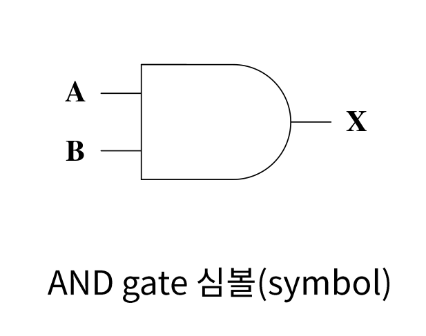
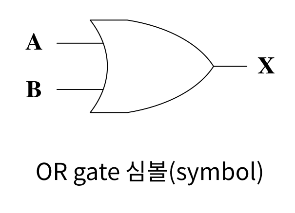
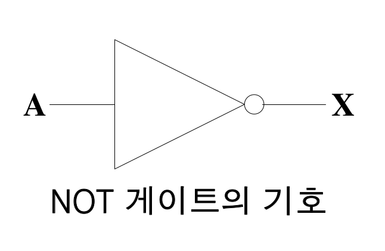
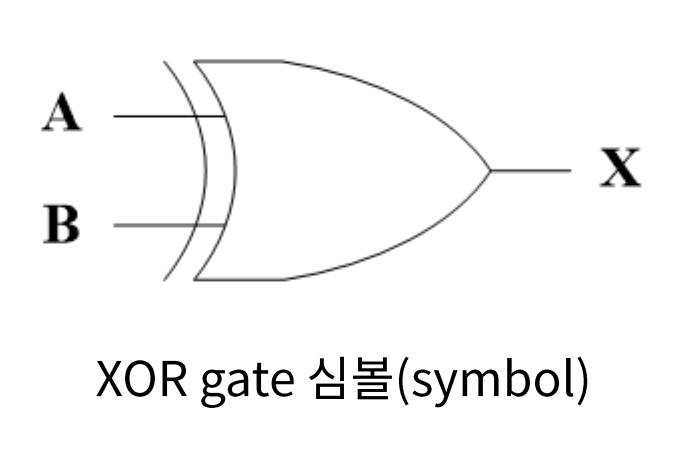

# Logical Gate

논리 게이트는 논리 연산을 수행하는 전자소자로서 

주어진 입력 변수 값에 대하여 정해진 논리 함수를 수행하여 

그 함수의 연산 경과와 동일한 결과값을 출력하는 하드웨어이다.

## 논리곱(AND)

$$
X  = A · B
$$

#### Truth Table

| 입력(A) | 입력(B) | 출력(X) |
| :-----: | :-----: | :-----: |
|    0    |    0    |    0    |
|    0    |    1    |    0    |
|    1    |    0    |    0    |
|    1    |    1    |    1    |

## 논리합(OR)

$$
X = A + B
$$

#### Truth Table

| 입력(A) | 입력(B) | 출력(X) |
| :-----: | :-----: | :-----: |
|    0    |    0    |    0    |
|    0    |    1    |    1    |
|    1    |    0    |    1    |
|    1    |    1    |    1    |

## 논리부정(NOT)

$$
X = \overline{A}
$$

#### Truth Table

| 입력(A) | 출력(X) |
| :-----: | :-----: |
|    0    |    1    |
|    1    |    0    |

## 배타적 논리합(exclusive OR)

$$
X = A\overline{B} + \overline{A}B
$$

#### Truth Table

| 입력(A) | 입력(B) | 출력(X) |
| :-----: | :-----: | :-----: |
|    0    |    0    |    0    |
|    0    |    1    |    1    |
|    1    |    0    |    1    |
|    1    |    1    |    0    |

