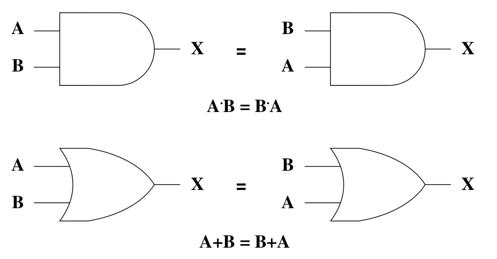
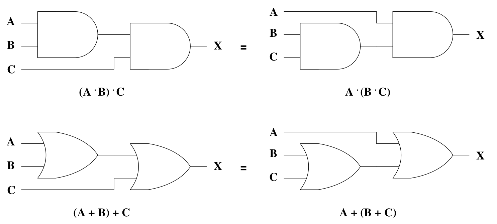
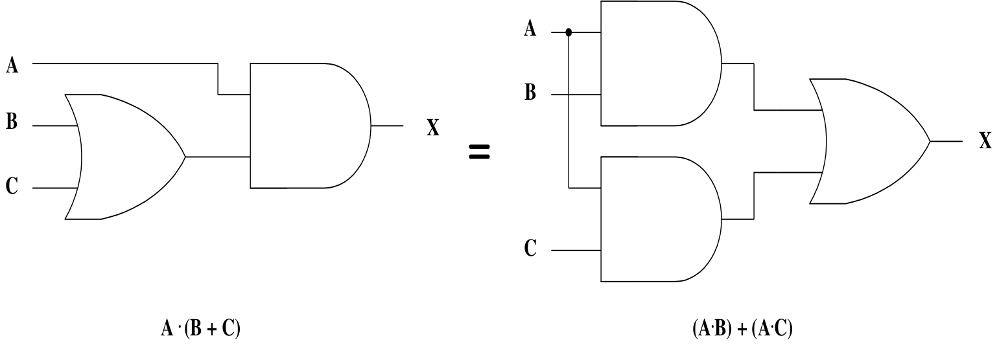
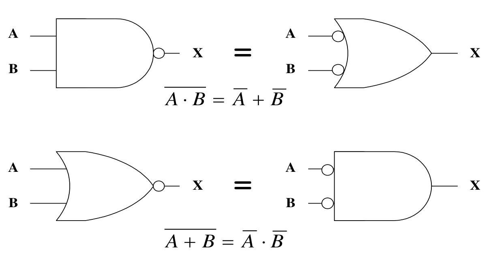

# Boolean Algebra

참(True)과 거짓(False)을 판별할 수 있는 논리적 명제를 수학적 표현의 논리 전개 식으로 구현

논리 회로의 형태와 구조를 기술하는데 필요한 수학적인 이론

부울 대수를 사용하면 변수들의 진리표 관계를 대수식으로 표현하기 용이

동일한 성능을 갖는 간단한 회로를 만들기 편리

기본 법칙은 4가지

- 교환법칙(Commutative Law)
- 결합법칙(Associative Law)
- 분배법칙(Distributive Law)
- 드모르강의 정리(De Morgan's Theorm)

## Commutative Law

## Associative Law

## Distributive Law

## De Morgan's Theorm

## Karnaugh Map

map 방법은 부울 함수를 곧바로 간소화 할 수 있으므로 널리 활용됨

표현방법

- 만약 변수가 n개 라면 카노 맵은 2^n 개의 민텀(minterm)으로 구성
- 각 인접 민텀은 하나의 변수만이 변경되어야 함
- 출력이 1인 기본 곱에 해당하는 민텀은 1로, 나머지는 0으로 표시

