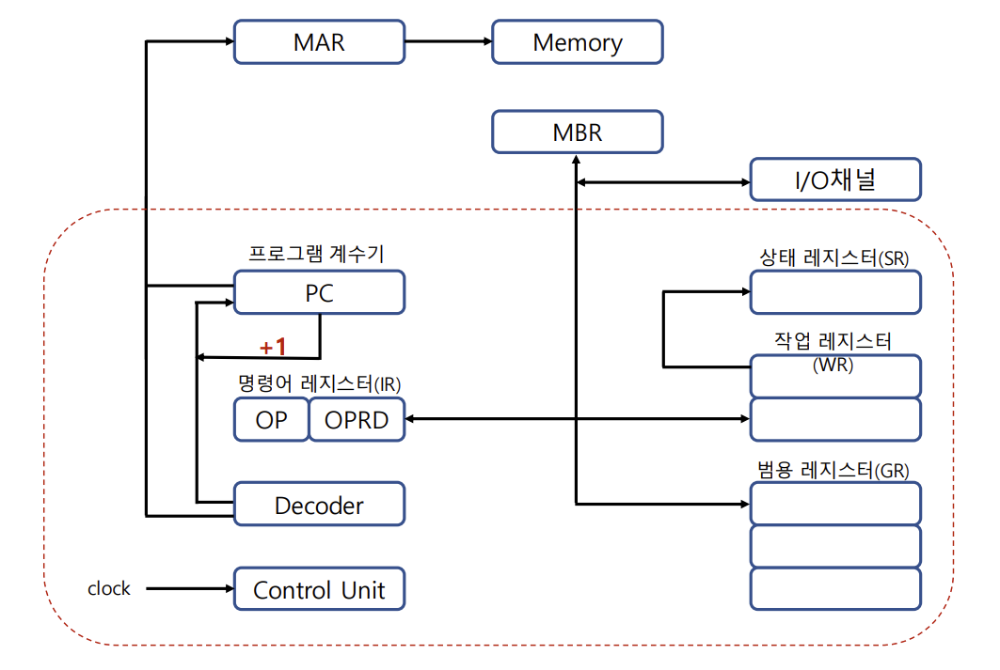

# CPU and Register

## CPU(Central Processing Unit)

컴퓨터에서 데이터 처리동작을 수해하는 부분을 중앙 처리 장치라고 함

CPU는 Register Set, ALU(Arithmetic Logic Unit), Control Unit 으로 구성됨

- Register Set: 레지스터 세터는 명령어를 실행하는데 필요한 데이터를 보관

- ALU: 명령어를 실행하기 위한 마이크로 연산 수행

  (마이크로 연산: 컴퓨터 내부에서 명령어 실행을 위해 일어나는 연산들)

- Control Unit: Register Set간 정보 전송 감시, ALU 에게 수행할 동작 지시

## Register

### PC(Program Counter)

프로그램 계수기는 다음에 수행될 명령어가 들어있는 주기억장치의 주소를 기억하고 있는 레지스터

IC(Instruction Counter, 명령어계수기) 혹은 LC(Location Counter) 라고도 부름

### IR(Instruction Register)

명령어 레지스터는 프로그램 계수기가 지정하는 주소에 기억되어있는 명령어를 해독하기 위해 임시 기억하는 레지스터

### ID(Instruction Decoder)

명령어 해독기는 IR에 들어있는 명령코드의 해석을 담당하는 논리 회로

여기서 해석이란 각종 명령 코드를 제어신호화하여 기계 사이클로 전송하는 것을 의미

### Control Unit

제어장치는 ID로부터 보내져온 신호에 따라 명령어를 실행(clock에 의해 발생)

### GPR(GR, General Purpose Register)

범용 레지스터는 작업 레지스터에서 data가 용이하게 처리되도록 임시로 자료를 저장하는 경우 사용

### WR(Working Register)

작업 레지스터는 산술논리연산을 실행할 수 있도록 자료를 저장하고 그 결과를 저장

GPR과의 차이점은 ALU에 연결되어있는지 유무

### SR(Status Register)

상태 레지스터는 CPU의 상태를 나타내는 특수목적의 레지스터

연산결과의 상태, 영 Z(zero), 부호 S(sign), 오버플로우 V(overflow), 캐리 C(carry), 인터럽트 I(interrupt)