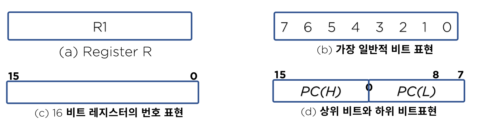
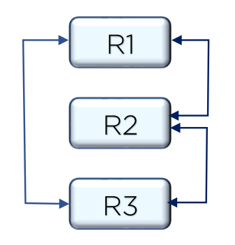
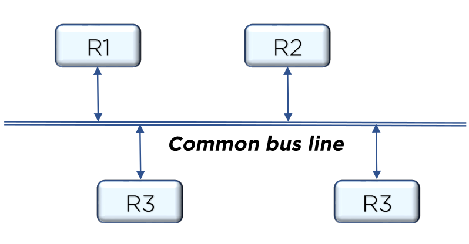

# Instruction Set

## Register Transfer Language

마이크로 연산(micro-operation)은 하나의 클럭 펄스 내에서 실행되는 기본적인 동작(shift, count, clear, road)

레지스터에 저장된 데이터의 조작을 위해 마이크로 연산이 실행되며

레지스터 간의 마이크로 연산 전송을 보다 간단하고 명료하게 표시하기 위해 사용하는 기호를 레지스터 전송 언어라고 함

**레지스터 전송 언어 역할**

- 디지털 컴퓨터의 내부 조직을 상세하게 나타내는 수단
- 디지털 시스템의 설계를 편리하게 해줌

## Register Transfer

레지스터는 머릿글자들을 대문자로 표시(MAR, PC, IR 등)

n비트 레지스터의 각 플립플롭들은 맨 오른쪽을 0으로 하여 n-1까지 번호를 매김

레지스터들 사이의 정보 전송은 치환 연산자를 이용하여 다음과 같이 나타냄
$$
R2 ← R1
$$

## CPU Design

 CPU 디자인은 CPU 내의 다양한 디바이스들간 상호 연결방법을 뜻함

1. 직접연결

   - 연결 복잡도가 장치수의 제곱에 비례 

     

2. 버스연결

   - 공용선에 의한 연결

   - 가장 가성비가 노은 연결 방식

   - 관리를 위한 다양한 방법이 있음

     