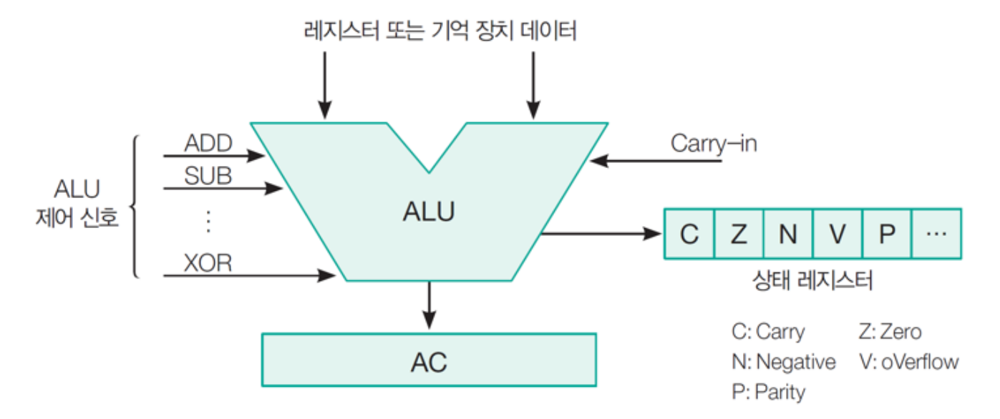

# Micro-Operation and ALU

## Micro-Operation

레지스터에 저장된 데이터에 대해 수해되는 기본적인 연산

마이크로 연산은 다음과 같이 네 가지로 분류됨

- 전송 마이크로 연산: 레지스터 사이에서 이진정보를 전송
- 산술 마이크로 연산: 레지스터에 저장된 수치 데이터에 대해 산술 연산을 수행
- 논리 마이크로 연산: 레지스터에 저장된 비수치 데이터에 대해 비트 조작 연산을 수행
- 시프트 마이크로 연산: 레지스터에 저장된 데이터에 대해 시프트 연산을 수행

##  ALU(Arithmetic Logic Unit)

ALU는 산술 논리 연산 장치로, 산술연산과 논리연산을 수행

주로 정수 연산을 처리하며, 최근 FLU(Floating-Point Unit)와 같은 부동 소수 연산도 수해

### Arithmetic Operate

덧셈, 뺄셈, 곱셈, 나눗셈, 증가, 감소, 보수

| operation | action             | explain                      |
| --------- | ------------------ | ---------------------------- |
| ADD       | _X ← A + B_        | A와 B를 더함                 |
| SUB       | _X ← A + (~B + 1)_ | A에 B의 2의 보수를 더함(A-B) |
| MUL       | _X ← A * B_        | A와 B를 곱함                 |
| DIV       | _X ← A / B_        | A를 B로 나눔                 |
| INC       | _X ← A + 1_        | A를 1 증가시킴               |
| DEC       | _X ← A - 1_        | A를 1 감소시킴               |
| NEG       | _X ← ~A + 1_       | A의 2의 보수                 |

### Logic Operate

AND, OR, NOT, XOR, Shift

| operation | action                    | explain                                          |
| --------- | ------------------------- | ------------------------------------------------ |
| AND       | _X ← A & B_               | A와 B를 비트단위로 AND 연산                      |
| OR        | _X ← A \| B_              | A와 B를 비트단위로 OR 연산                       |
| NOT       | _X ← ~A_                  | A의 1의 보수 처리 혹은 A의 부정 처리             |
| XOR       | _X ← A ^ B_               | A와 B의 비트단위 XOR 연산 처리                   |
| ASL       | _X ← A << n_              | 왼쪽으로 n비트 시프트                            |
| ASR       | _X ← A >> n, A[7] ← A[7]_ | 오른쪽으로 n비트 시프트(부호 유지)               |
| LSL       | _X ← A << n_              | 왼쪽으로 n비트 시프트                            |
| LSR       | _X ← A >> n_              | 오른쪽으로 n비트 시프트                          |
| ROL       | _X ← A << 1, A[0] ← A[7]_ | 왼쪽으로 1비트 회전 시프트, MSB는 LSB로 시프트   |
| ROR       | _X ← A >> 1, A[7] ← A[0]_ | 오른쪽으로 1비트 회전 시프트, LSB는 MSB로 시프트 |

