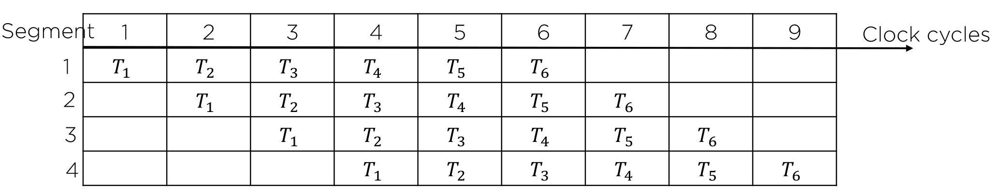

# Parallel Processing and Pipeline

## Parallel Processing

병렬 처리는 컴퓨터 시스템의 계산 속도 향상을 목적으로 하여 동시 데이터 처리 기능을 제공하는 기술

### M.J Flynn

| 분류 |                                        | 설명                                                         |
| ---- | -------------------------------------- | ------------------------------------------------------------ |
| SISD | 단일 명령어 흐름 단일 데이터 흐름 | - 제어장치, 처리장치, 메모리 장치를 가지는 단일 컴퓨터 구조 - 명령어들은 순차적으로 실행되고, 병럴처리는 다중 기능 장치나 파이프라인 처리에 의해서 구현됨 |
| SIMD | 단일 명령어 흐름 다중 데이터 흐름 | - 공통의 제어장치 아래에 열 개의 처리 장치를 두는 구조 - 모든 프로세서는 동일한 명령어를 서로 다른 데이터 항목에 대하여 실행시킬 수 있음 - 모든 프로세서가 동시에 메모리에 접근할 수 있도록 다중 모듈을 가진 공유 메모리 장치가 필요 |
| MISD | 다중 명령어 흐름 단일 데이터 흐름 | - 현재는 이론적으로만 연구되고 있음                          |
| MIMD | 다중 명령어 흐름 다중 데이터 흐름 | - 여러 프로그램을 동시에 수행하는 능력을 가진 컴퓨터 시스템 - 대부분의 다중 프로세서와 다중 컴퓨터 시스템이 이 범주에 속함 |

> 컴퓨터의 외양적 행동 양식을 강조한 분류방식
>
> 파이프라인은 이 중 어떤 것에도 해당하지 않음

 

## Pipeline

파이프라인의 동작은 공간/시간표에 의해 설명되며, 이 것은 시간에 대한 함수로서 세그먼트의 사용상황을 보여줌

파이프라인의 이론적 최대 속도 증가율은 세그먼트 수와 같음

(여기서 세그먼트는 반복 횟수임)

> t_p: 클럭 사이클 시간
>
> k개의 세그먼트 파이프라인에서 n개의 테스크를 수행한다고하면(=완료하려면)
>
> (k + (n - 1))t_p 만큼의 시간이 소요되며, k + (n - 1) 클럭 사이클을 함
