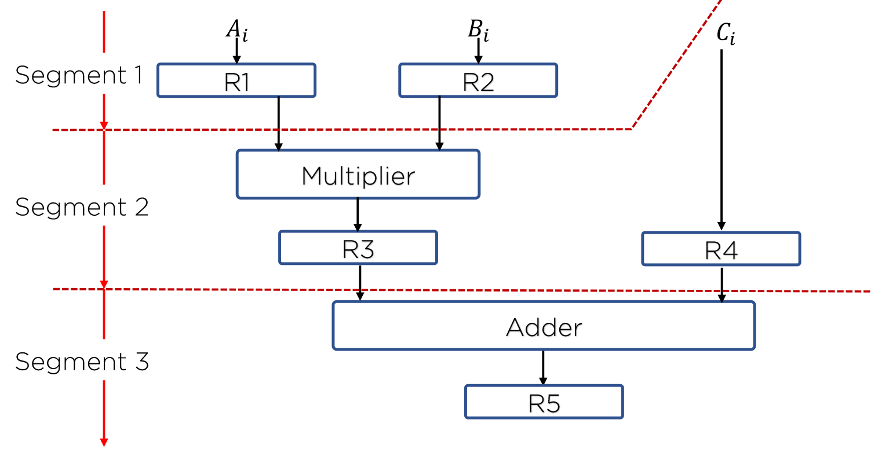

# Pipeline Structure

파이프라인은 하나의 프로세스를 서로 다른 기능을 가진 여러 개의 서브프로세스로 나누어 각 프로세스가 동시에 서로 다른 데이터를 취급하도록 하는 기법

각 세그먼트에서 수행된 연산결과는 다음 세그먼트로 연속적으로 넘어가게 되어 데이터가 마지막 세그먼트를 통과하게 되면 최종적인 연산 결과를 얻게 됨

세그먼트 별 레지스터를 통해 중간 결과를 저장할 수 있으며 다양한 연산을 중복할 수 있음

파이프라인 기술은 매번 다른 데이터 집합을 동일한 task에 적용시켜 여러 번 반복하는 경우 효과적

파이프라인의 이론적 최대 속도 증가율은 세그먼트 수와 같음

(하지만 각 세그먼트들이 부연산을 실행하는 속도가 모두 다르고, 

클럭 사이클은 최대 전파시간을 갖는 세그먼트의 지연시간과 싱크를 맞춰야하므로 최대 속도 구현 불가)

## Arithmetic Pipeline

산술 연산들을 부연산으로 나누어 파이프라인의 세그먼크에서 수행

고속 컴퓨터에서 부동 소수점 연산, 고정 소수점 수의 곱셉, 과학계산용으로 활용

## Instruction Pipeline

명령어 사이클의 fetch, 디코드, 실행 단계를 중첩시킴으로 명령어 흐름에 동작

분기가 발생할 경우, 현재 파이프라인은 모두 비워져야하며, 분기 명령 이후에 메모리에서 읽어온 명령은 모두 무시되어야한다는 취약점이 있음

  
