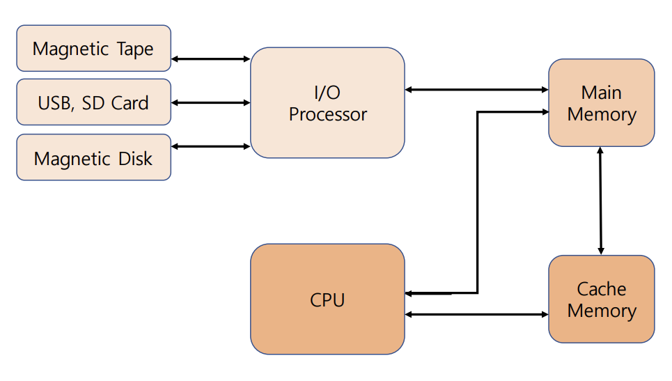
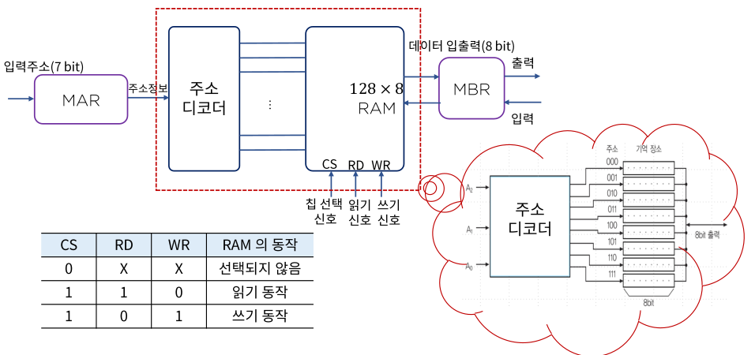

#  Memory System

기억장치는 CPU에 의하여 시행될 프로그램이 저장되는 곳으로

이는 주 기억 장치(Main Memory Unit), 보조 기억 장치(Auxiliary Memory Unit), 캐시 메모리(Cache Memory)로 분류됨

메모리를 이와 같이 계층별로 나누어 사용하는 이유는 경제성 때문임

## Main Memory Unit

Motherboard(마더보드)에 장착됨

###  종류

- RAM(Random Access Memory) - 비교적 대용량, 고속, 휘발성 성질을 지님
  - SRAM(Static RAM): 전원이 연결되어 있는 동안 정보가 유지됨(Flip-Flop으로 구성), 사용이 편리하고 읽기와 쓰기 시간이 짧음(cache)
  - DRAM(Dynamic RAM): 주기적으로 재충전해주어야 정보가 유지됨, 전력 소비가 적고 하나의 칩으로 대량의 정보를 저장할 수 있음

- ROM(Read Only Memory) - 읽어내는 작업만 가능, 부트스트랩 로더(bootstrap loader), 전원의 on/off와 무관하게 작동되기 때문에 불변하는 상수의 표 등이 저장됨

### 동작원리

## Auxiliary Memory Unit

비교적 저속, 대용량의 자료 보관이 가능

보조기억장치 내 자료는 필요한 경우 주기억장치로 옮겨짐(Loading)

### 종류

- Magnetic Tape, USB, SD card: 필요한 파일의 새성 및 삭제 가능
- Magnetic Drum, Disk: backup 저장 장치
- Core Memory, Magnetic Bubble, CCD(Charge Coupled Device): 대용량 저장 장치

### 특성

- 접근시간: 메모리 내의 기억장소에 도달하여 그 내용을 얻는데 요구되는 평균 시간
- Seek Time(시크 타임): read/write head가 지정된 기억장소에 도달하는데 소요되는 시간
- Transfer Time(트랜스퍼 타임): 추출된 데이터를 장치 내 또는 장치 밖 필요한 곳으로 전송하는데 요구되는 시간
- Record(레코드): 일반적으로 데이터가 기록되는 단위, 시크타임을 체크하게 되느 기준(일정한 길이의 수치 또는 문자 집합)
- 전송률: 장치가 레코드의 시작점에 위치한 다음 단위 시간 당(보통 분) 전송할 수 있는 문자나 위드의 수

## Cache Memory(Buffer)

주기억장치 접근시간 > 프로세스 논리회로

현재 진행되고 있는 프로그램의 일부 또는 사용빈도가 높은 임시 데이터 저장

