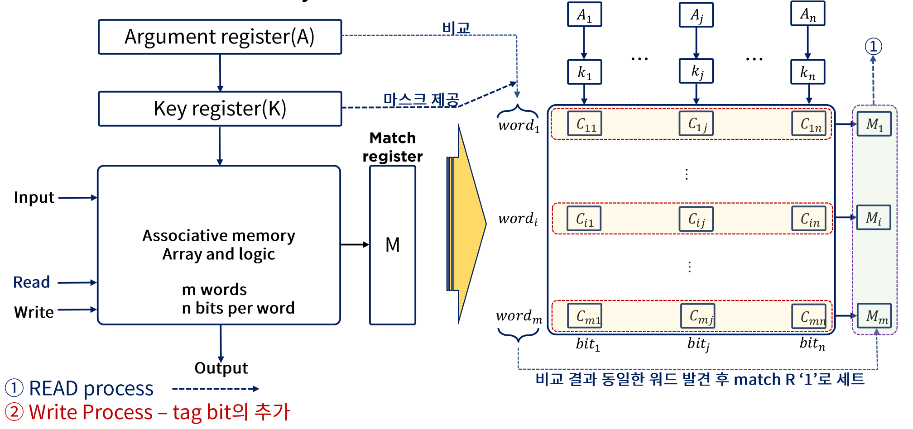

# Memory Manage Policy

## Associative Memory

Memory device(메모리 장치)란 자료의 저장과 접근을 용이하게 하기 위해 필요한 장치이며

Associative Memory는 내용에 의해 접근하는 메모리 장치를 뜻함

데이터의 내용으로 병렬탐색을 하기 적합하게 구성되어있으며

탐색은 전체 워드 또는 한 워드내 일부를 가지고 실행될 수 있음

각 셀이 저장능력과 논리회로를 가지고 있어 가격이 비쌈

탐색시간이 짧아야하는 중요한 이슈에 활용됨

## Cache Memory

프로그램이 수행되는 동안 메모리 참조는 국한된 영역에서만 이루어진다는 것이 Locality of Reference(참조의 국한성)인데,

캐시메모리는 이런 참조의 국한성을 이용해 속도는 빠르고 작은 메모리만을 사용하여

평균 메모리 접근 시간의 단축과 전체 프로그램 수행 시간 단축을 할 수 있음

### Cache의 기본 동작

1. cache를 체크
2. 워드가 발견되면(hit) 이를 읽어들이고 발견되지 않으면(miss) 주기억장치에 접근함
3. 주기억장치의 워드를 포함한 블록을 cache에 전송하여 저장

### Cache Memory Mapping Process

- Associative Mapping: 내용으로 접근하는 associative memory로 캐시를 구성
- Direct Mapping: SRAM을 캐시로 사용, 하나의 공간에 하나씩만 저장하는 방식(히트율 높임)
- Set-associative Mapping: direct mapping의 단점을 극복하기 위해 주어진 공간에 병렬로 저장