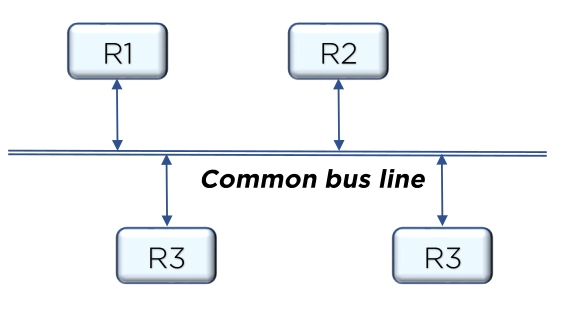
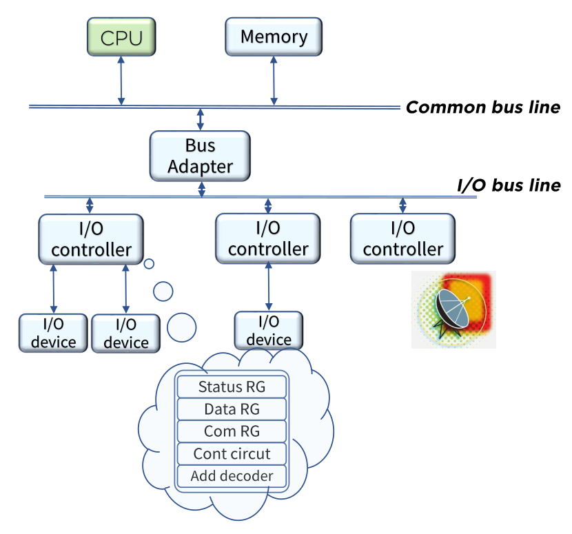

# System BUS

BUS란 한 번에 하나의 전송만이 이루어지도록 제어신호를 이용하여 레지스터를 선별하는 시스템

레지스터 사이의 정보 전송과 입출력 관장을 BUS를 통해 실시

> 여러 레지스터들을 각자 연결하지 않고 Common bus line을 통해 연결함

> bus adapter가 I/O bus line과 Common bus line을 연결
>
> CPU가 외부 주변 장치(입출력 장치) 및 통신의 주체로서 정보의 입출력 관장하도록 함

## System BUS Control

컴퓨터 시스템에서 각 요소들 사이의 정보 전송을 위한 다양한 단계의 여러 버스가 존재

- 메모리버스: 데이터, 주소, 읽기/쓰기 정보 전송
- I/O버스: 입출력 장치로 정보를 주고 받는데 사용

공유메모리 멀티 프로세서 시스템에서 프로세서는 시스템 버스를 통하여 공유 자원에 대한 접근을 요구

IEEE 표준 796 다중 버스 신호를 표준으로 사용함

- 공유자원이 사용되고 있지 않을 경우: 사용 승인
- 공유자원이 사용되고 있을 경우: 선점 프로세스의 종료까지 대기상태 유지
- 동시에 시스템 버스를 요구하는 경우: 공유자원에 대한 충돌을 해결하기 위한 중재(arbitration)수행