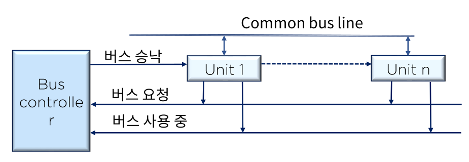
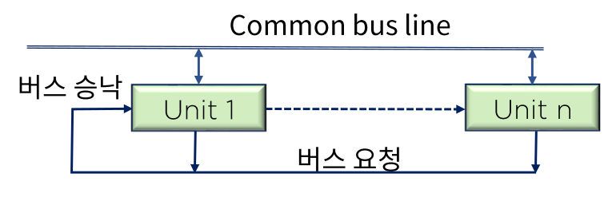

#  I/O Mapping and Address

## I/O Mapping

컴퓨터 시스템에 다양한 입출력 장치를 연결할 때 각 입출력 장치에 고유한 주소를 할당하며

하나의 입출력 장치의 상태나 용도에 따라 다수의 주소 할당이 가능함

### Memory Mapped I/O

메모리에 부여된 주소 공간의 일부를 입출력 주소 공간으로 활용

동일한 주소선과 제어선으로 입출력 관리 가능

시스템은 지정된 주소 값에 의해 데이터 저장 공간과 I/O장치 구분

모든 CPU에 대해 구현이 가능하나 H/W적 분류 접근 구현이 필요

### I/O Mapped I/O

독립된 메모리 주소 공간과 입출력 주소 공간을 구분하여 할당

메모리와 입출력 주소를 구분하는 제어선을 사용

상호 동일한 주소일 경우 상호 구분되는 명령어가 필요

제어 신호를 통해 메모리/입출력 장치에 접근이 가능하도록 H/W적 구현이 필요

## I/O Bus

### Central Control BUS system

구현 및 관리가 용이하나 제어기의 이상시 버스 중재 및 활용에 지대한 결함이 발생할 수 있음

I/O버스는 주로 중앙 제어 버스 시스템을 적용

### Distributed Control BUS System

버스 상의 모든 장치가 제어 기능을 나누어 실행

시스템 버스로 분산 제어 버스 시스템을 선호

### Dynamic Control Algorithm

정적 우선순위 알고리즘에 대해 시스템이 동작하고 있는 동안 장치들의 우선순위를 변경시킬 필요가 있을 경우 사용

입출력 버스를 할당할 때 동적 중재 알고리즘을 사용

#### Time Slice Algorithm

연속적으로 주어지는 버스 시간을 고정된 길이의 시간 분할로 나누고 이를 라운드로빈 방식으로 각 프로세스에 할당

버스에서의 위치에 관계없이 모든 요소들이 동등한 서비스를 받게 됨

#### Polling

폴 라인으로 버스 승인 신호를 대체하여 모든 장치에 연결

버스제어기는 이 신호를 이용하여 각 장치의 주소를 결정

지정된 순서에 따라 버스를 할당

프로그램으로 우선순위 변경 가능

#### LRU Algorithm

가장 오랫동안 버스 서비스를 사용하지 못한 장치에게 우선권을 부여

몇 번의 버스 사이클마다 least recently used algorithm에 의해 각 장치의 우선순위가 계속 변경됨

모든 프로세스가 버스에 접근할 수 있는 기회를 동등하게 부여받을 수 있음

#### First-come & First-serve

버스 제어기는 각 프로세스의 버스 요구 도착시간별 저장이 가능한 큐를 이용해 도착한 순서대로 서비스 제공

#### Rotating Daisy Chain

모든 장치를 closed loof(연결)하여 차례로 버스 서비스를 제공하는 방식

