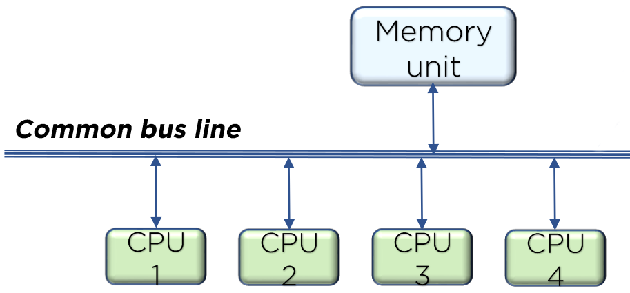
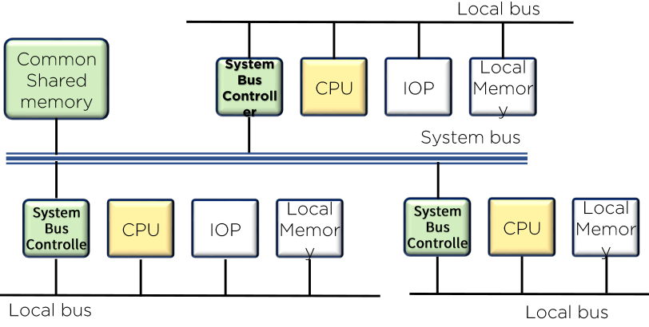
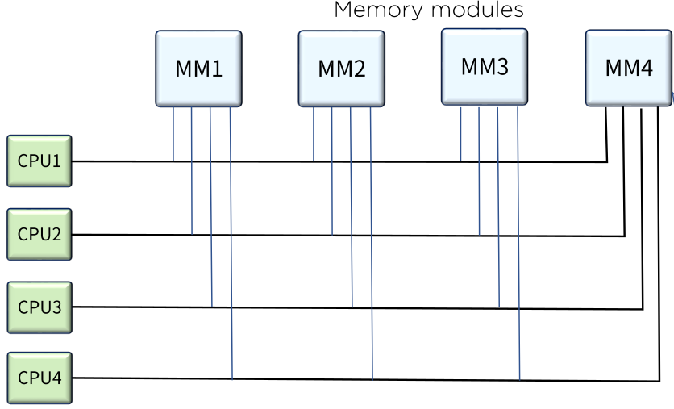
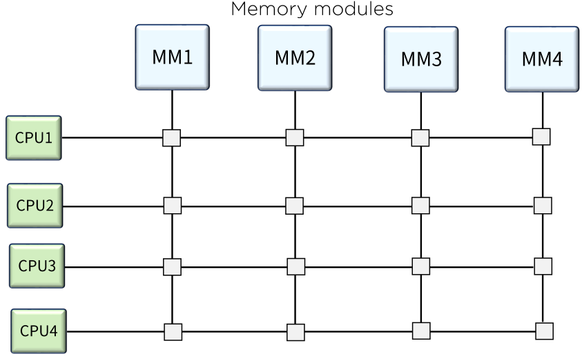

# Multiprocessor

## Serial Process System VS Parallel Process system

### Serial Process System

CPU가 하나뿐인 시스템

기계적, 논리적 프로세싱으로는 가장 효율적임

### Parallel Process System

동시에 여러 명령 또는 여러 작업을 실행할 수 있는 병렬처리 시스템

- 다중 장치 구조
  - 공간적 병렬성(spatial parallelism)
  - 다수의 CPU로 동시에 여러 개의 작업을 병렬로 처리할 수 있는 시스템
- 파이프라인 구조
  - 시간적 병렬성(temporal parallelism)
  - 다수의 작업을 각기 다른 실행 단계에서 병렬로 처리할 수 있도록 지원되는 구조(CPU가 여러개X)

## Multiprocessor System

메모리와 I/O 장치를 공유하는 두 개 이상의 CPU를 갖는 시스템

다중 명령어 흐름과 다중 데이터 흐름으로 분류됨

멀티 프로세서 시스템에서는 하나의 운영체제에 의해 프로세서와 시스템의 다른 요소들 사이에서 상호동작이 제어되며, 동일한 문제의 해결을 위해 모든 요소들이 협력함 (멀티 컴퓨터는 운영체제가 여러 개일 수 있음)

멀티프로세서는 다수의 독립적인 작업들을 병렬적으로 처리하거나 하나의 작업을 여러 부분으로 나누어 각각을 병렬적으로 처리함

이 때 사용자가 명시적으로 병렬 실행이 가능한 작업을 선언하거나 컴파일러가 자동적으로 프로그램의 병렬성을 감지하여 처리함

멀티프로세서는 다음과 같이 분류할 수 있음

- Shared-memory Multiprocessor

- Tightly Coupled Multiprocessor

- Distributed Memory Multiprocessor

- Loosely Coupled Multiprocessor

### 상호 연결 구조

멀티 프로세서 시스템은 CPU, IOP 그리고 여러 모듈로 분리된 메모리 장치에 의해 구성됨

공유 메모리 시스템은 프로세스와 메모리 사이의 경로수에 따라 구분되며

느슨히 결합된 시스템은 프로세싱 요소들 사이의 전송 경로수에 따라 다양한 구성을 보임

#### Common Bus System

- 주어진 시간에 오직 하나의 프로세서만이 전송을 수행할 수 있음
- 충돌 발생 가능성이 있으나 버스 제어기에 의해 해결 가능
- 시스템 내의 전체 전송률이 단일 경로의 속도에 제한될 수 있음

#### Dual Bus System

- 각 프로세서들의 대기시간이 줄어들고 여러 개의 버스 전송이 동시에 진행 가능
- 시스템 구축 비용과 복잡도는 증가
- 시스템 버스 제어기에 의해 각 로컬 버스를 시스템 버스에 연결
- 주어진 시간엔 하나의 프로세서만이 시스템 버스를 사용

#### Multiport Memory

- CPU 또는 IOP와 각 메모리 모듈이 버스라인을 갖고 있는 시스템
- 각 모듈은 주어진 시간에 어떤 포트가 메모리에 접근할 수 있는가를 결정하기 위한 내부 논리 회로를 가지고 있음
- 메모리 접근을 위한 우선순위는 일반적으로 포트 위치에 따라 결정
- 프로세스와 메모리 사이에 전송률이 높음
- 고가의 메모리 제어 논리 회로와 전선 커넥터 사용

#### Crossbar Switch

- 프로세스 버스와 메모리 모듈 통로 간의 교차점에 위치한 다수의 cross point로 구성
- cross point(크로스 포인트)란 프로세서와 메모리 모듈간의 통로를 결정하는 스위치
- cross point는 버스에 실린 주소를 확인하여 통로를 열어줄 뿐만 아니라 주어진 순위에 따라 중재역할도 가능

#### Multistage Switch

- 다단망에서 기본 요소는 2입력, 2출력 상호교환 스위치
- 2개의 입력 중 하나만을 선택하여 전체 경로를 연결해주는 기능과 충돌을 중재하는 기능으로 구성된 연결 구조
- 입력과 출력 단자를 연결할 수 있는 제어신호 필요

#### Hypercube

- 2^n개의 프로세서가 n차원 이진 큐브로 연결된 느슨히 결합된 시스템을 의미
- 각 프로세서는 큐브의 노드를 생성
- 노드에는 CPU, 로컬 메모리, I/O인터페이스 등이 포함됨