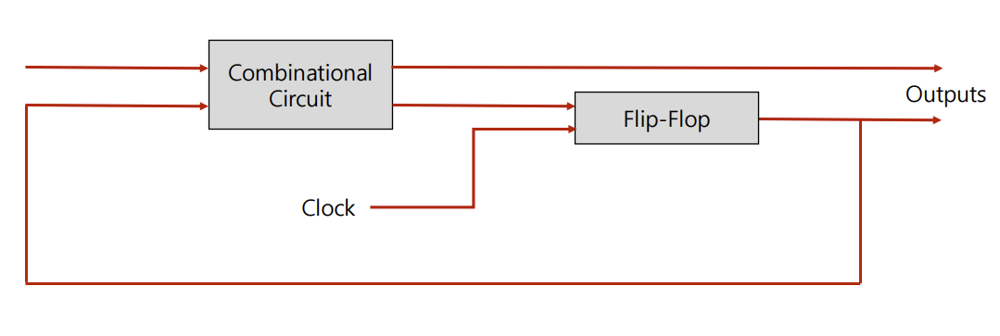

# Logic Gate

## Combinational Circuit

조합 회로는 입력과 출력을 가진 논리 게이트의 집합

출력은 현재의 입력(0,1)값과 조합의 함수

조합 회로는 게이트들로만 이루어짐

**설계 절차**

1. 문제 제시
2. 입력과 출력 변수에 문자기호 할당
3. 입력과 출력 사이의 관계를 정의하는 진리표 유도
4. 각 출력에 대한 간소화된 부울 함수 얻기
5. 논리도 작성

### Adder

두 개 혹은 그 이상의 입력을 받아 결과물을(합) 출력하는 조합 논리 회로

**종류**

- Half Adder
- Full Adder

### Subtracter

두 개 혹은 그 이상의 입력을 받아 그 차를 산출하는 조합 논리 회로

**종류**

- Half Subtracter
- Full Subtracter

### Multiplexer

다수의 입력선 중 하나만을 선별적(시그널 조작)으로 출력 가능하게 해주는 조합 논리 회로

### Demultiplexer

하나의 입력선을 다수개의 출력선으로 분해하는 기능의 조합회로(멀티플렉서의 역기능)

## Sequential Circuit

순차 회로는 플립플롭과 게이트를 서로 연결한 것임

게이트들로만 이루어진 조합 회로에 플립플롭이 포함되면 순차 회로가 됨

순차 회로의 외부 출력은 외부 입력과 플립플롭의 현 상태의 함수로 표시됨

### Flip-Flop

순차 회로로 구현되는 저장요소(기억능력이 있음)

**종류**

- SR flip-flop
- D flip-flop
- JK flip-flop
- T flip-flop

