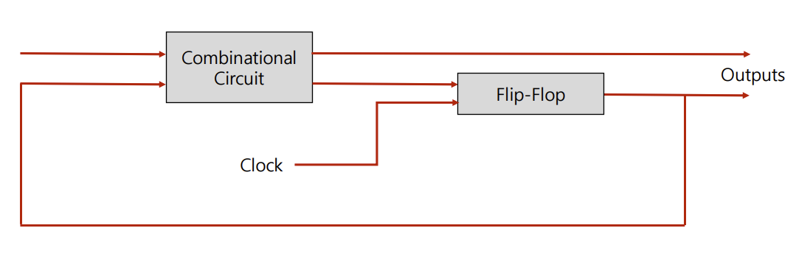

# Combinational Circuit

조합 회로는 입력과 출력을 가진 논리 게이트의 집합

출력은 현재의 입력(0,1)값과 조합의 함수

순차 논리 회로는 게이트 뿐만 아니라 기억능력이 있는 Flip-Flop으로 구성됨

**설계 절차**

1. 문제 제시
2. 입력과 출력 변수에 문자기호 할당
3. 입력과 출력 사이의 관계를 정의하는 진리표 유도
4. 각 출력에 대한 간소화된 부울 함수 얻기
5. 논리도 작성

## Adder

두 개 혹은 그 이상의 입력을 받아 결과물을 출력하는 조합 논리 회로

**종류**

- Half Adder

- Full Adder

## Multiplexer

다수의 입력선 중 하나만을 선별적(시그널 조작)으로 출력 가능하게 해주는 조합 논리 회로

## Demultiplexer

하나의 입력선을 다수개의 출력선으로 분해하는 기능의 조합회로(멀티플렉서의 역기능)