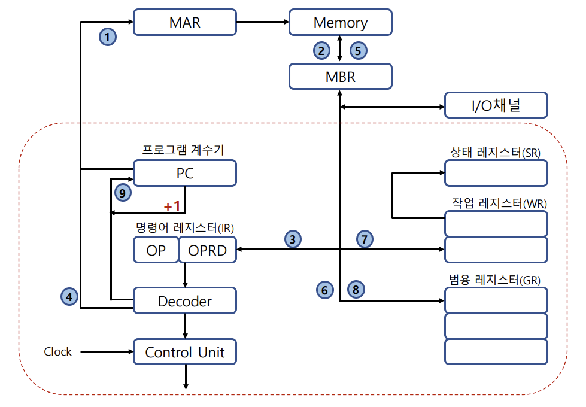

# CPU and Register

## CPU(Central Processing Unit)

컴퓨터에서 데이터 처리동작을 수해하는 부분을 중앙 처리 장치라고 함

CPU는 Register Set, ALU(Arithmetic Logic Unit), Control Unit 으로 구성됨

- Register Set: 레지스터 세터는 명령어를 실행하는데 필요한 데이터를 보관

- ALU: 명령어를 실행하기 위한 마이크로 연산 수행

  (마이크로 연산: 컴퓨터 내부에서 명령어 실행을 위해 일어나는 연산들)

- Control Unit: Register Set간 정보 전송 감시, ALU 에게 수행할 동작 지시

