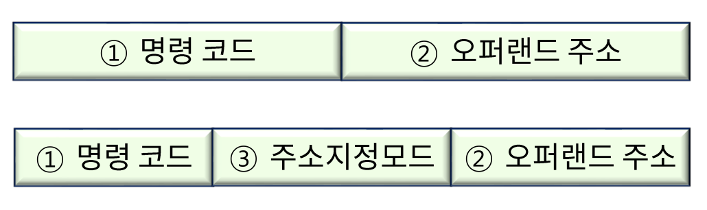

# Instruction Set

## Instruction Type

실행 순서에 따라 아래와 같이 나눌 수 있음

- 순차적 실행 명령어(전체 실행 명령어의 70~80% 차지)
- 분기 명령어
- 부 함수 호출 명령어
- 복귀 명령어

## Instruction Format

- 명령 코드(Opcode): CPU가 실행할 수 있도록 디자인 된 연산
- 오퍼랜드(Operand): 연산에 사용되는 잘 값, 자료가 저장된 주소에 관한 정보
- 주소 지정 모드(Addressing Mode): 오퍼랜드가 저장된 위치를 인덱싱(지정)하는 방법, direct방식과 indirect방식이 있음

## Instruction Set Design

| 설계 관점          | 자연어에 가까운 명령 코드                                    | 기계 중심의 명령 코드                                        |
| ------------------ | ------------------------------------------------------------ | ------------------------------------------------------------ |
| 프로그램의 관점    | - 프로그램이 용이 - 전체 프로그램의 길이 감소 - 번역기의 설계 용이 | - 프로그래밍 규칙이 많아짐 - 프로그램의 길이 증가 - 번역기의 설계가 복잡해짐 |
| CPU 구조 설계 측면 | - 사용 언어에 따른 구조적 차이로 인한 오동작 및 처리 어려움 - 명령어의 길이 증가 - 제어장치(ALU, Register 등)의 제어가 매우 복잡해짐 | - 다양한 업체별, 국가별 프로그래밍의 표준화가 가능 - 명령어의 종류 및 길이 등이 간편화 될 수 있음 - 제어장치(ALU, Register 등)의 제어가 상대적으로 용이 |

