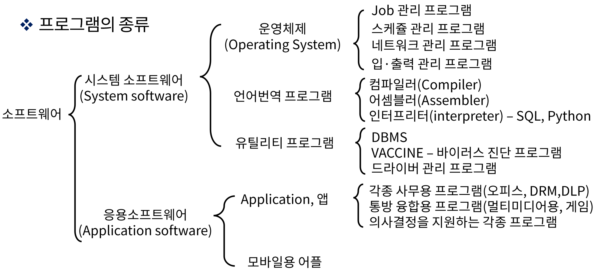

# Computer Programming

컴퓨터는 Hard Ware(하드웨어)와 Soft Ware(소프트웨어)로 구성됨

하드웨어를 제어하고 지시하는 모든 종류의 프로그램을 소프트웨어라 함

소프트웨어는 시스템 소프트웨어와 응용 소프트웨어로 나눌 수 있음

프로그램을 작성할 때는 사용자 위주의 프로그래밍 언어인 고급 언어 프로그램으로 내용을 작성

기계는 이런 형태의 프로그래밍 언어를 이해할 수 없기 때문에, 이 기호 프로그램의 내용을 하드웨어가 인지할 수 있도록 이진프로그램으로 옮겨야함(컴파일 언어)

## Machine Code

프로그램이란 컴퓨터로 데이터 처리 업무를 시행시키기 위해 작성된 명령어 또는 문장으로 구성된 리스트

- 이진코드: 메모리상에 나타나는 형태의 명령어로 이진수 명령어와 피연산자의 시퀀스
- 8/16진수: 이진수 코드를 편의상 8/16진수 형태로 표현한 내용
- 기호코드: 사용자가 연산 부분, 주소 부분 등에 대하여 기호(문자, 숫자 , 특수문자 등)르 사용하게 되며, 각 기호 명령어는 하나의 이진 코드로 번역됨(이 번역은 어셈블러가 담당)
- 고급 프로그래밍 언어: 컴퓨터 하드웨어의 동작을 염두에 두지 않고 문제 해결에 관점을 맞춰서 개발한 인간 중심의 언어로 컴파일러형 언어라고도 함(C, C#, Java 등)

## Assembly Language

Mnemonic(니모닉)이란 기억하기 용이한 형태로 이름을 나타내는 기호이며 AND, ADD, LDA 등이 있으며 주로 어셈블리 언어에서 사용됨

모든 컴퓨터는 각각의 어셈블리 언어를 가지고 있으며, 이에 대한 규칙 등은 컴퓨터 제조 업체로부터 출판됨

### Rule

- 라벨 필드: 기호 주소를 나타내거나 빈 칸이 됨, 기호 주소는 세 개 이하의 영자숫자들로 구성, 첫 자는 문자여야 함

- 명령어 필드: 기계 명령어나 슈도 명령어를 기술(MRI, non-MRI, sudo)

- 코멘트 필드: 명령어에 대한 주석이나 해설을 하며 불필요한 경우 생략 가능

  