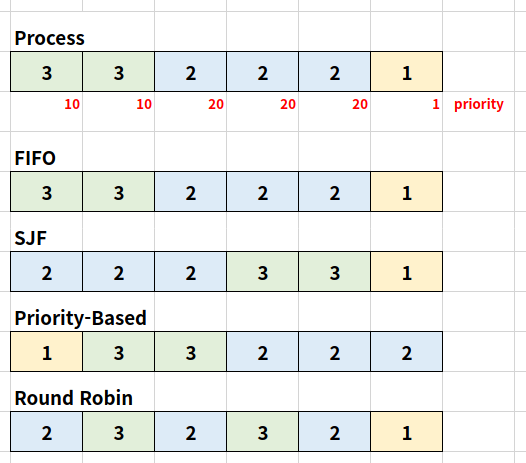

#  Scheduling Algorithm

## Process

메모리에 올려져서 실행 중인 프로그램을 프로세스라고 함

단, 여기서 응용 프로그램 != 프로세스

(하나의 응용 프로그램은 여러 개의 프로세스가 상호작용을 하면서 실행될 수도 있기 때문 -> IPC 기법)

## Scheduler

프로세스 실행을 관리함

##  Scheduling Algorithm

목표를 세우고 목표에 기반하여 어떤 순서로 프로세스를 실행시킬지 결정해둔 것

###  FIFO Scheduler

> 프로세스가 저장매체를 읽는 등의 작업 없이 CPU를 계속 사용하는 경우

- 가장 간단한 스케줄러
- 배치 처리 시스템에서 사용
- FCFS(First Come First Served) 스케줄러

### SJF Scheduler

- 가장 프세스 실행시간이 짧은 프로세스부터 먼저 실행을 시키는알고리즘
- 실행시간을 미리 다 알아야하는 단점이 있음
- SJF(Shortest Job First) 스케줄러(최단 작업 우선 스케줄러)

### Priority-Based Scheduler

- 프로세스의 우선순위를 먼저 매겨놓고 우선순위가 높은 순서대로 먼저 프로세스를 실행(우선순위 기반 스케줄러)

- 정적 우선순위
  - 프로세스마다 우선순위를 미리 지정(사람이 직접 지정)
- 동적 우선순위
  - 스케줄러가 상황에 따라 우선순위를 동적으로 변경

### Round Robin Scheduler

- 시분할 시스템을 기반으로 함
- 일정 시간이 지나면 이전의 프로세스가 끝나지 않았더라도 다음 프로세스를 실행함
- 끝나지 않았던 프로세스는 준비 queue의 맨 뒤로 옮김

---

## OS

### RealTime OS(RTOS)

응용 프로그램 실시간 성능 보장을 목표로 하는 OS

정확하게 프로그램 시작, 완료 시간을 보장(시간에 매우 민감)

공장, 공정 등에서 사용

Hardware RTOS, Software RTOS 등으로 세분화하기도 함

### General Purpose OS(GPOS)

프로세스 실행시간에 민감하지 않고 일반적인 목적으로 사용되는 OS

Linux, Window 같은 것들이 여기에 해당