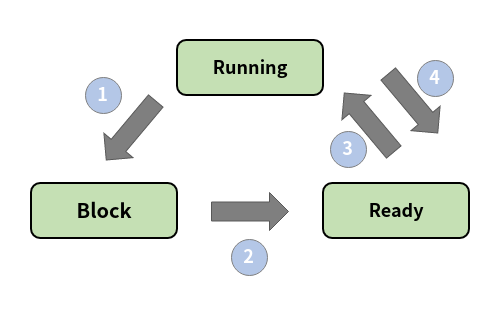

# Process State

- running state: 현재 CPU에서 실행 상태
- ready state: CPU에서 실행 가능 상태(실행 대기 상태)
- block state: 특정 이벤트 발생 대기 상태

1. Process block for input
2. Process becomes available
3. Scheduler picks another process
4. Scheduler picks this process
