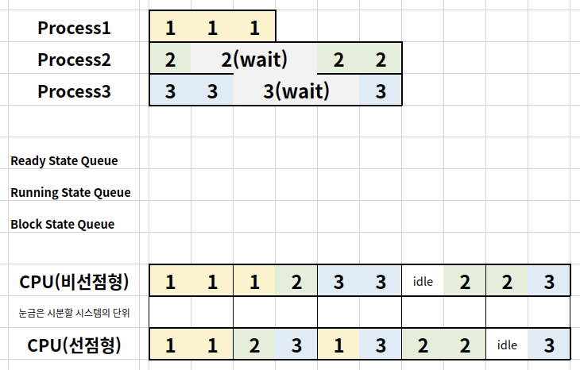

# Preemptive and None-preemptive Scheduler

## Preemptive Scheduling

하나의 프로세스가 다른 프로세스 대신에 프로세서(CPU)를 차지할 수 있음

즉, 프로세스가 running인 상태에서 스케줄링 알고리즘 정책에 따라 

진행중인 프로세스를 중단시키고 다른 프로세스를 running 상태로 변경할 수 있음

선점형 스케줄러를 사용할 때 응답속도가 더 빠르며 최적의 스케줄링이 가능

최신 운영체제의 대부분 스케줄러는 선점형 스케줄러임

## Non-Preemptive Scheduling

하나의 프로세스가 끝나지 않으면 다른 프로세스는 CPU를 사용할 수 없음

즉, 프로세스가 running인 상태에서  waiting 또는 terminated 상태로 변경되었을 때에만 

스케줄러가 ready 상태에 있는 또 다른 프로세스를 running 상태로 변경할 수 있음

## Example

