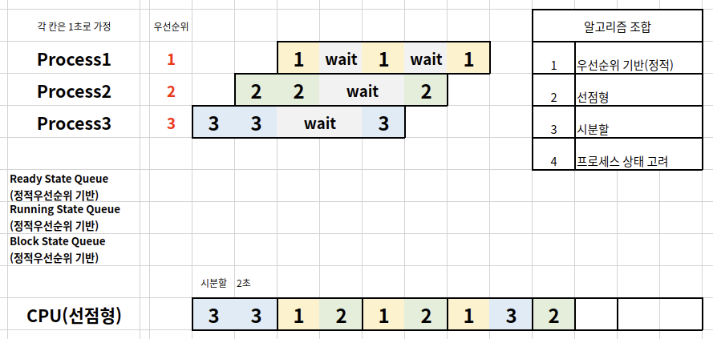

#  Scheduling Algorithm Combination

## Policy

스케줄러 구분

- 비선점형 스케줄러: 어떤 프로세스를 먼저 실행시킬지에 대한 알고리즘(FIFO, SJF, Priority-based)

- 선점형 스케줄러: 시분할 시스템을 위한 기본 알고리즘(RoundRobin)

이런 스케줄러를 여러 개 조합하여 사용

## Example

