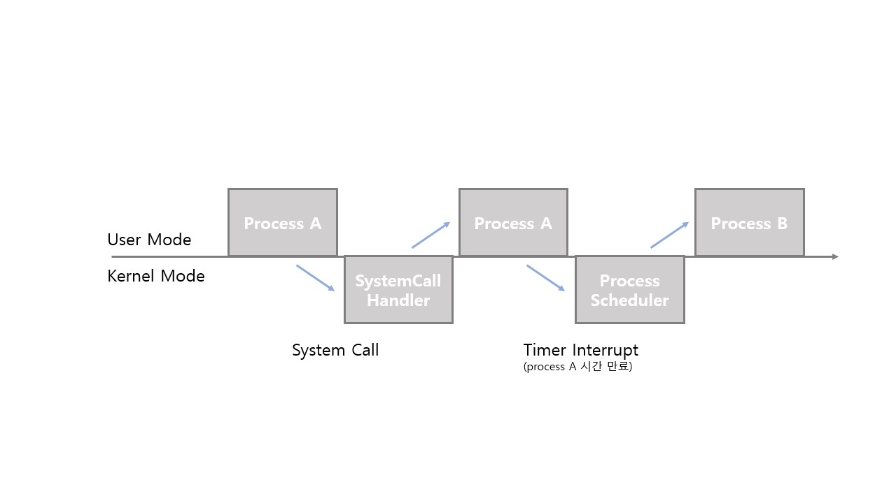
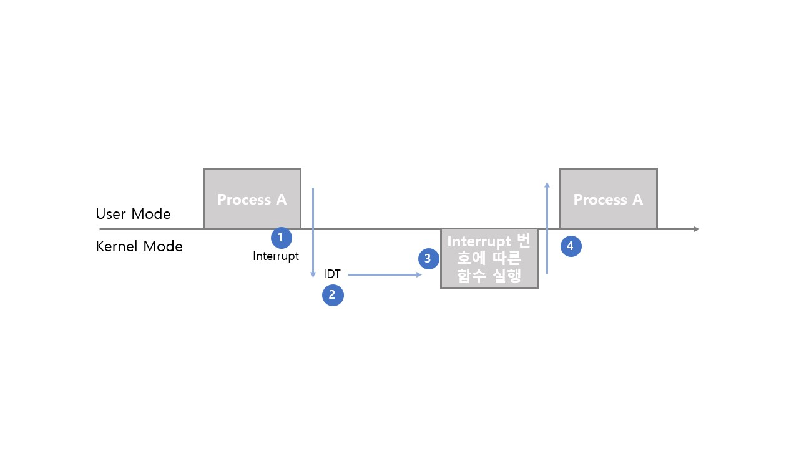

# Interrupt Internals

## System Call Interrupt

시스템콜 실행을 위해서는 강제로 코드에 interrupt 명령을 넣어 CPU에게 실행시켜야 함

### Code

- eax 레지스터에 시스템콜 번호를 넣음
- ebx 레지스터에 시스템콜에 해당하는 인자값을 넣음
- 소프트웨어 인터럽트 명령을 호출하면서 0x80값을 넘겨줌
- 시스템콜 interrupt 명령을 호출하면서 0x80값을 넘겨줌
  - CPU는 사용자 모드를 커널 모드로 바꿔줌
  - IDT(Interrupt Descriptor Table)에서 0x80에 해당하는 주소(함수)를 찾아서 실행함
  - system_call() 함수에서 eax로부터 시스템콜 번호를 찾아서, 해당 번호에 맞는 시스템콜 함수로 이동
  - 해당 시스템콜 함수 실행 후, 다시 커널모드에서 사용자모드로 변경
  - 프로세스 다음 코드 실행

```c
mov eax, 1
mov ebx, 0
int 0x80
```

> int 는 CPU op code를 의미
>
> 0x80 은 시스템콜의 interrupt 번호를 의미

| %eax | kernel function (system call) |      %ebx      |
| :--: | ----------------------------- | :------------: |
|  1   | sys_exit (exit)               |      int       |
|  2   | sys_fork (fork)               | struct pt_regs |
|  3   | sys_read (read)               |  unsigned int  |
|  4   | sys_write (write)             |  unsigned int  |
|  5   | sys_open (open)               |   const char   |


## User Mode, Kernel Mode and Interrupt

실제로 user mode와 kernel mode를 계속 오고가면서 process가 실행됨



## Interrupt and IDT

interrupt는 미리 정의되어있고

컴퓨터 부팅 시 각각 번호와 실행 코드가 매핑된 IDT(Interrupt Descriptor Table)가 기록되며

실행코드에 해당하는 동작은 운영체제 내부 코드에 구현되어있음

(IDT에는 `0x80 -> system_call()` 과 가은 정보가 기록되어있음)

따라서 interrupt가 발생하면 IDT를 확인하고, IDT내 정의된 실행 코드를 실행한다.


### Example

리눅스의 경우, 아래와 같이 IDT가 정의되어있다.

- 0 ~ 31: 소프트웨어 interrupt
- 32 ~ 47: 하드웨어 interrupt
- 128: 시스템콜


## Interrupt and Process

1. 프로세스 실행 중 interrupt 발생
2. 현 프로세스 실행 중단
3. interrupt 처리 함수 실행
4. 현 프로세스 재실행

