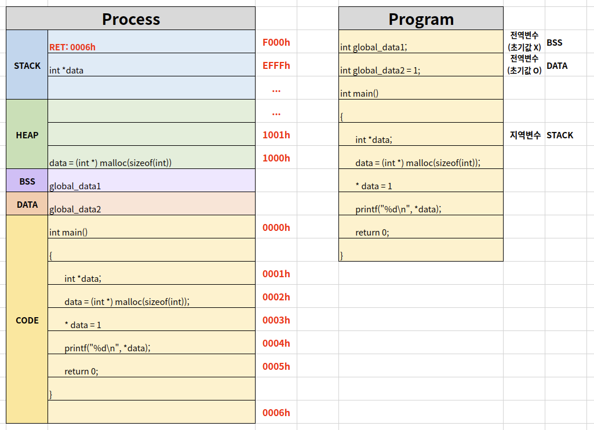
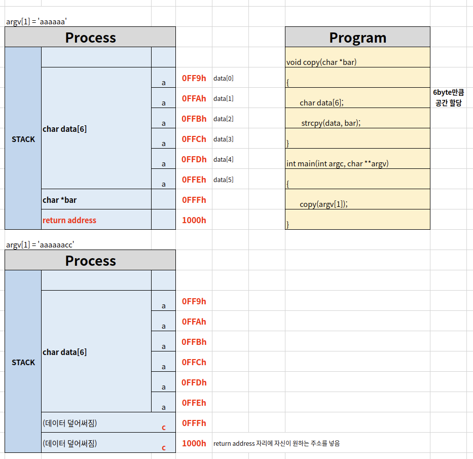

# Process 

## Process and Context Switching

context switching: A라는 프로세스를 CPU에서 실행하다가 스케줄러가 B라는 프로세스로 바꿔주는 것


## Process

1. CODE(text)): 코드
2. DATA: 변수/초기화된 데이터
3. STACK: 임시 데이터(함수 호출, 로컬 변수 등)
4. HEAP: 코드에서 동적으로 만들어지는 데이터


 

## Process and Computer Structure

**EBP**

현재 stack pointer의 최상단을 가리키는 주소가 들어있음

함수를 트래킹할 때 많이 사용하는 레지스터

**EAX**

반환값이 들어가는 레지스터


## Process and Heap

**Heap**

Data는 전역변수를 컴파일러가 미리 체크하고 공간을 만들어두는 것이고(정적이며 변하지 않음),

Heap은 컴파일러에서 알 수 없고 실행코드 안에서 동적으로 메모리를 할당하기 위한 공간이다.

```C
#include <stdio.h>
#include <stdlib.h>

int main()
{
    int *data;  #포인터 변수
    data =(int *) malloc(sizeof(int));
    *data = 1;
    printf("%d\n", *data);
    
    return 0;
}
```

> malloc은 동적으로 메모리 할당(반대는 free)


## Process and Data

**Data**

- BSS: 초기화되지 않은 전역변수
- DATA: 초기값이 있는 전역변수




## Process and Stack Overflow

**Stack Overflow**

Stack에 할당된 메모리보다 많은 양의 데이터를 넣어 덮어써 return address를 변경하여 자신이 원하는 코드를 실행하게 하고 시스템 운영체제 전반의 슈퍼관리자 권한을 얻게하는 기술

주로 해커들의 공격에 활용되었음(원하는 코드에 해킹하는 코드 작성)

