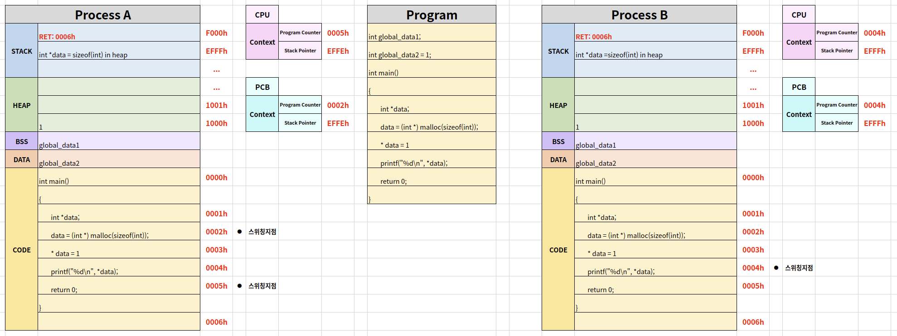
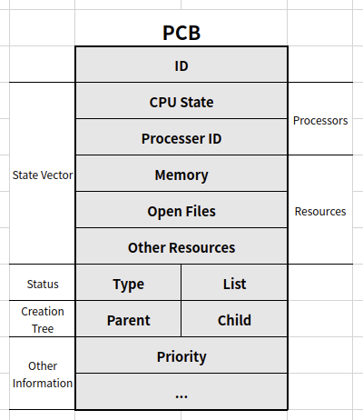

# Process and Context Switching

## Context Switching

A라는 프로세스를 CPU에서 실행하다가 스케줄러가 B라는 프로세스로 바꿔주는 것

프로세스 구조에 기반하여 PC(Program Counter)와 SP(Stack Pointer)의 동작에 의해 가능

굉장히 많이 일어나는 작업이므로 C언어로 작성되었을 경우 오버헤드가 발생할 수 있어 어셈블리어로 되어있음

> dispatch(디스패치): ready 상태의 프로세스를 running 상태로 바꾸는 것

### Example

1. CPU가 Process A를 실행
2. 첫번째 스위칭 지점에서 컨텍스트 스위칭이 발생
   - Process A의 정보를 Process A의 PCB에 업데이트, 메인메모리 저장
   - 메인메모리에 저장된 Process B의 PCB 정보를 CPU 레지스터에 업데이트
3. CPU는 Process B를 실행
4. 두 번째 스위칭 지점에서 컨텍스트 스위칭이 발생
   - Process B의 정보를 Process B의 PCB에 업데이트, 메인메모리 저장
   - 메인메모리에 저장된 Process A의 PCB 정보를 CPU 레지스터에 업데이트
5. CPU가 다시 Process A를 실행

## PCB(Process Control Block)

PCB는 프로세스가 실행중인 상태를 캡쳐 및 구조화하여 저장하는 공간

아래와 같은 값들이 저장됨

- Process ID
- Register 값(PC, SP 등)
- Scheduling Info(Process State)
- Memory Info(Memory Size Limit) 등

### Example(Linux)

