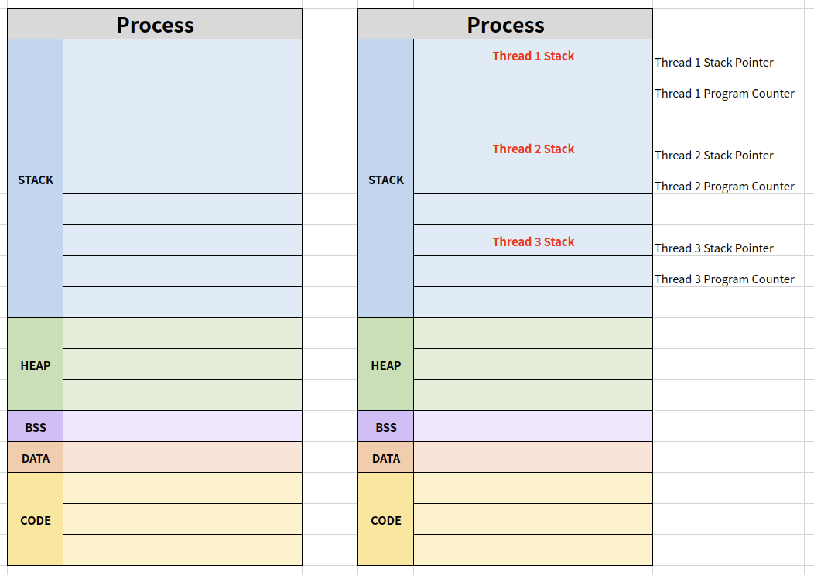

# Thread

Light Weight Process라고도 함

Thread는 각기 실행이 가능한 stack이며, 하나의 프로세스 안에서 data, file, code 등은 공유하지만 registers와 stack이 따로 있음

- 프로세스
  - 프로세스 간에는 각 프로세스의 데이터 접근이 불가
- 스레드
  - 하나의 프로세스에 여러 개의 스레드 생성 가능
  - 스레드들은 동시에 실행 가능
  - 프로세스 안에 있으므로, 프로세스의 데이터를 모두 접근 가능

## Multi Thread

소프트웨어 병행 작업 처리를 위해 Multi Thread를 사용

### Multi Tasking and Multi Processing

- Multi Tasking

하나의 CPU에 여러 개의 프로세스를 실행

일정 주기마다 프로세스를 변경해주면서 사람이 보기에 동시에 여러 프로세스가 실행되는 것처럼 보이게 함

- Multi Processing

하나의 프로세스를 여러 개의 CPU를 사용하여 실행 혹은 여러 개의 프로세스를 여러 개의 CPU를 사용하여 실행

여러 개의 CPU를 사용하여 병럴처리하므로 실행속도가 높음

여기서 하나의 프로세스를 여러 개로 쪼개는 방법이 thread를 여러 개 만드는 것(=Multi Thread)

