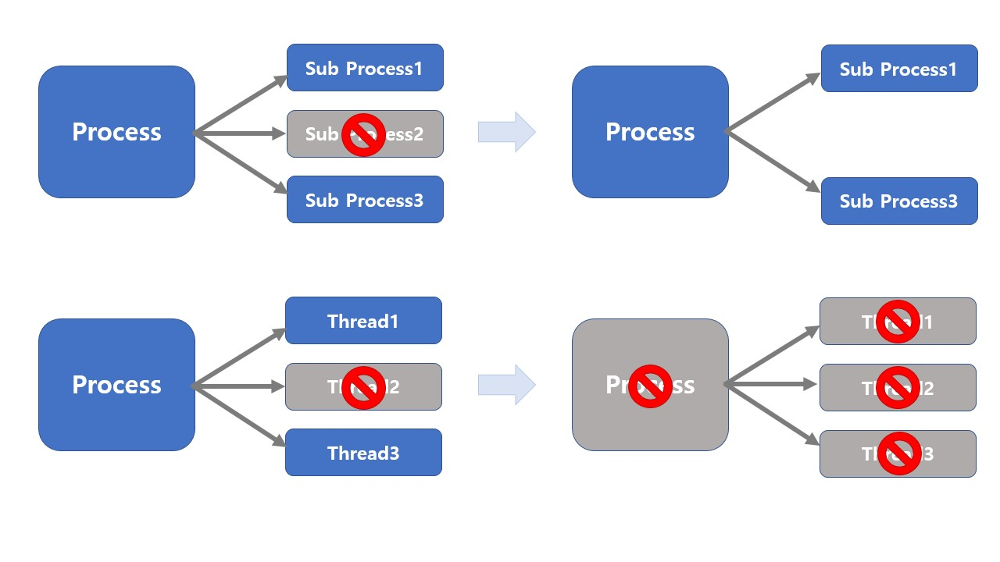

# Thread Pros and Cons

## Thread Pros

1.  사용자에 대한 응답성 향상

   

2. 자원 공유 효율

   - IPC 기법과 같이 프로세스간 자원 공유를 위해 번거로운 작업이 필요 없음
   - 프로세스 안에 있으므로 프로세스의 데이터에 모두 접근 가능

3.  작업이 분리되어 코드가 간결

## Thread Cons

1. 스레드 중 한 스레드만 문제가 있어도 전체 프로세스가 영향을 받음

   

2. 스레드를 많이 생성하면 Context Switching이 많이 일어나 성능이 저하됨

   - 스레드를 많이 생성하면, 모든 스레드를 스케줄링해야 하므로 Context Switching이 빈번할 수밖에 없음

## Thread vs Process

1. 프로세스는 독립적, 스레드는 프로세스의 서브셋
2. 프로세스는 각각 독립적인 자원을 가짐, 스레드는 프로세스 자원 공유
3. 프로세스는 자신만의 주소영역을 가짐, 스레드는 주소영역 공유
4. 프로세스간에는 IPC기법으로 통신해야 함, 스레드는 필요 없음

## PThread

POSIX 스레드: Thread 관련 표준 API