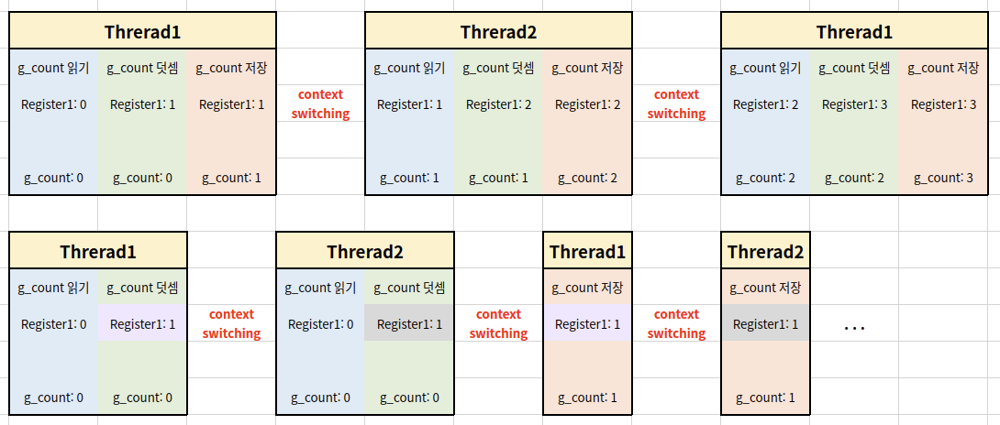

# Thread Synchronization

synchronization(동기화): 작업들 사이에 실행 시기를 맞추는 것

여러 스레드가 동일한 자원(데이터)에 접근 시 동기화 이슈가 발생함

즉, 동일 자원을 여러 스레드가 동시 수정 시, 각 스레드 결과에 영향을 끼침




## Mutual Exclusion

mutual exclusion(상호배제)를 통해 동기화 이슈를 해결할 수 있음

스레드는 프로세스의 모든 데이터에 접근할 수 있으므로, 여러 스레드가 변경하는 공유 변수에 대해 한 스레드가 공유 변수를 갱신 중일 때 다른 스레드가 접근하지 못하게 하는 Exclusive Access가 필요

- critical resource(임계 자원): 동시 갱신하면 안되는 변수 등
- critical section(임계 영역): 동시 실행하면 안되는 코드


## Example

```python
import threading

g_count = 0

def thread_main():
    global g_count
    for i in range(10000):
        g_count = g_count + 1
        
threads = []

for i in range(50):
    th = threading.Thread(target = thread_main)
    threads.append(th)

for th in threads:
    th.start()
    
for th in threads:
    th.join()  // 다른 스레드가 다 끝날때까지 기다림
    
print('g_count = ', g_count)
```

> g_count 변수를 각 스레드에서 계속 읽고 쓰면서 계산 누락이 발생


### Mutual Exclusion

- lock.acquire(), lock.release()

```python
import threading

g_count = 0

def thread_main():
    global g_count
    lock.acquire()
    for i in range(10000):
        g_count = g_count + 1
    lock.release()
        
lock = threading.Lock()
threads = []

for i in range(50):
    th = threading.Thread(target = thread_main)
    threads.append(th)

for th in threads:
    th.start()
    
for th in threads:
    th.join()
    
print('g_count = ', g_count)
```

> lock.acquire 를 한 스레드가 실행중이면 컨텍스트 스위칭이 된다고해도 다른 스레드가 lock.acquire 아래 코드를 실행할 수 없음
