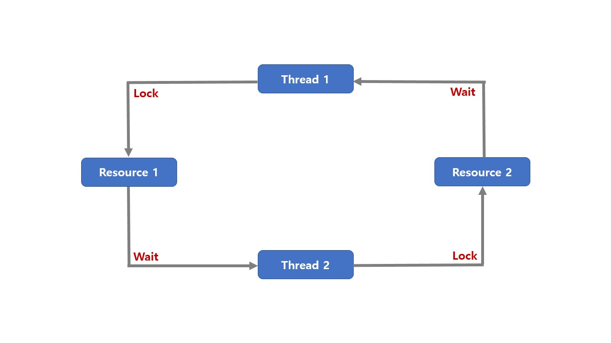

# Deadlock and Starvation

## Deadlock

deadlock(교착상태)란 무한 대기 상태로,

두 개 이상의 작업이 서로 상대방의 작업이 끝나기만을 기다리고 있어 다음 단계로 진행하지 못하는 상태

배치 처리 시스템에서는 일어나지 않는 문제임

프로세스, 스레드 둘 다 이와 같은 상태가 일어날 수 있음

### Condition

다음 네 가지 조건이 모두 성립될 때, 교착상태 발생 가능성이 있음

1. 상호배제(Mutual exclusion): 프로세스들이 필요로 하느 자원에 대해 배타적인 통제권을 요구한다.
2. 점유대기(Hold and wait): 프로세스가 할당된 자원을 가진 상태에서 다른 자원을 기다린다.
3. 비선점(No preemption): 프로세스가 어떤 자원의 사용을 끝낼 때까지 그 자원을 뺏을 수 없다.
4. 순환대기(Circular wait): 각 프로세스는 순환적으로 다음 프로세스가 요구하는 자원을 가지고 있다.

### Prevention

교착상태 4가지 조건 중 하나를 제거하는 방법

1. 상호배제 조건의 제거: 임계 영역 제거
2. 점유와 대기 조건의 제거: 한 번에 모든 필요 자원 점유 및 해제
3. 비선점 조건의 제거: 선점 가능 기법을 만들어줌
4. 순환 대기 조건의 제거: 자원 유형에 따라 순서를 매김

###  Avoidance

교착상태 조건 중 순환대기 조건 제거(자원 할당 순서를 정의하지 않음)

나머지 조건을 건드릴 경우 비효율성 증대

## Starvation

starvation(기아상태)는 특정 프로세스의 우선순위가 낮아서 원하는 자원을 계속 할당하지 못하는 상태

### Prevention

우선순위 변경

- 프로세스 우선순위를 수시로 변경해서, 각 프로세스가 높은 우선순위를 가질 기회를 제공
- 오래 기다린 프로세스의 우선순위를 높여주기
- 우선순위가 아닌 요청 순서대로 처리하는 FIFO기반 요청 큐 사용

## Deadlock vs Starvation

deadlock은 여러 프로세스가 동일 자원 점유를 요청할 때 발생

starvation은 여러 프로세스가 부족한 자원을 점유하기 위해 경쟁할 때, 특정 프로세스는 영원히 자원 할당이 안되는 경우를 주로 의미함
