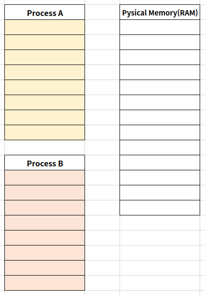
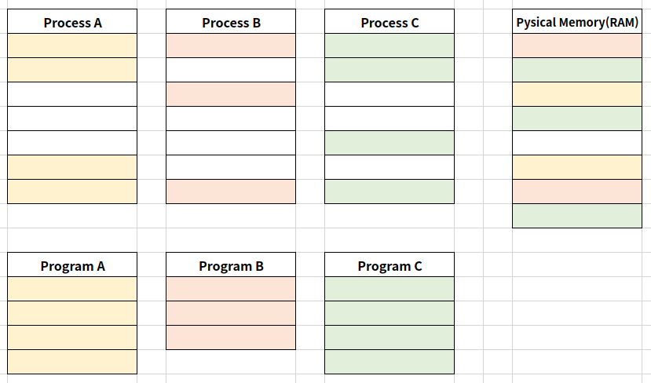
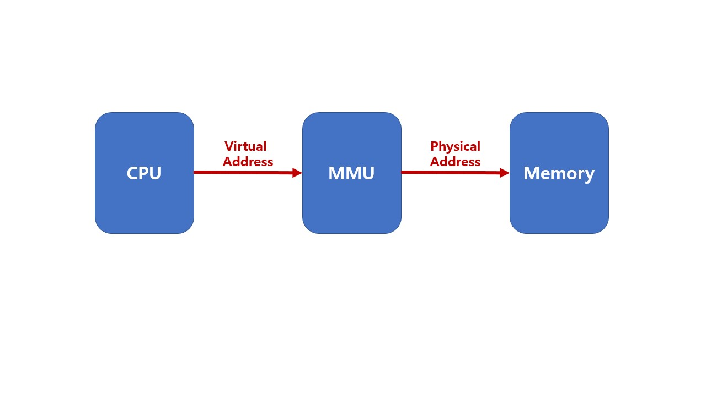

# Virtual Memory System

실제 각 프로세스마다 충분한 메모리를 할당하기에는 메모리 크기에 한계가 있음

하나의 프로세스만 실행 가능한 시스템(배치 처리 시스템 등)에서는 가상메모리가 필요하지 않음

그러나 여러 프로세스를 동시 실행하는 시스템은

1. 메모리 용량 부족
2. 프로세스 메모리 영역간 침범 이슈

가 발생할 수 있어 가상 메모리가 필요함.

## Virtual Memory

메모리가 실제 메모리보다 많아보이게 하는 기술

각 프로세스가 실제 사용하는 메모리는 작다는 점에서 착안하여 고안됨

프로세스간 공간 분리로, 프로세스 이슈가 전체 시스템에 영향을 주지 않을 수 있음

### Basic Idea

전체 프로세스 데이터를 특정시간에 한꺼번에 참조하지 않고 일부분만 참조하므로, 일부분만 물리주소에 넣음

프로세스는 가상 주소를 사용하고, 실제 해당 주소에서 데이터를 읽거나 쓸 때만 물리주소로 바꿔줌

- virtual address(가상 주소): 프로세스가 참조하는 주소
- physical address(물리 주소): 실제 메모리 주소

여기에서 가상 주소를 물리 주소로 변환하는데 시간이 많이 소요됨에 따라 

MMU(Memory Management Unit)이라는 별도의 하드웨어 장치를 둠

- MMU: CPU에서 코드 실행 시 , 가상 주소 메모리 접근이 필요할 때 해당 주소를 물리 주소값으로 변환해주는 장치

