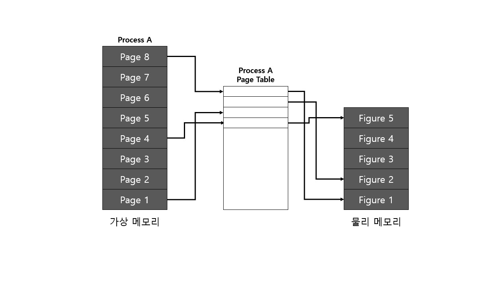
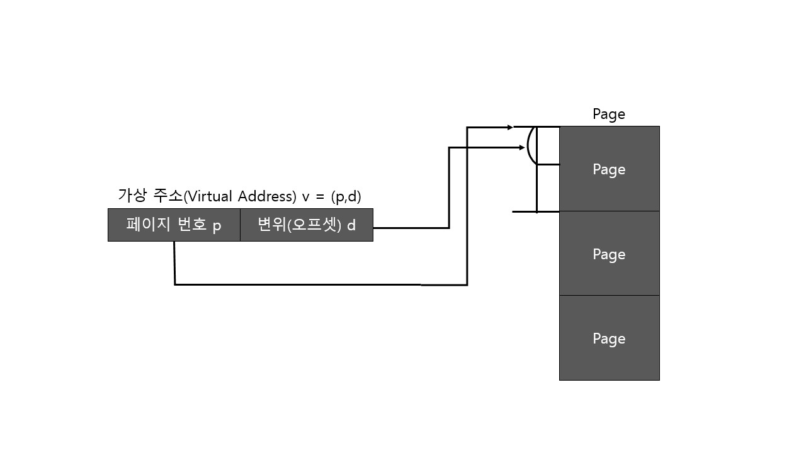
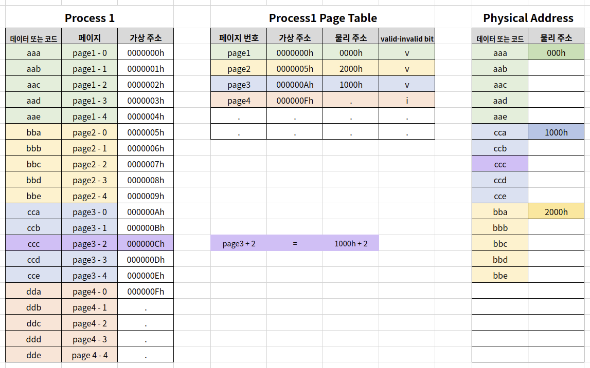
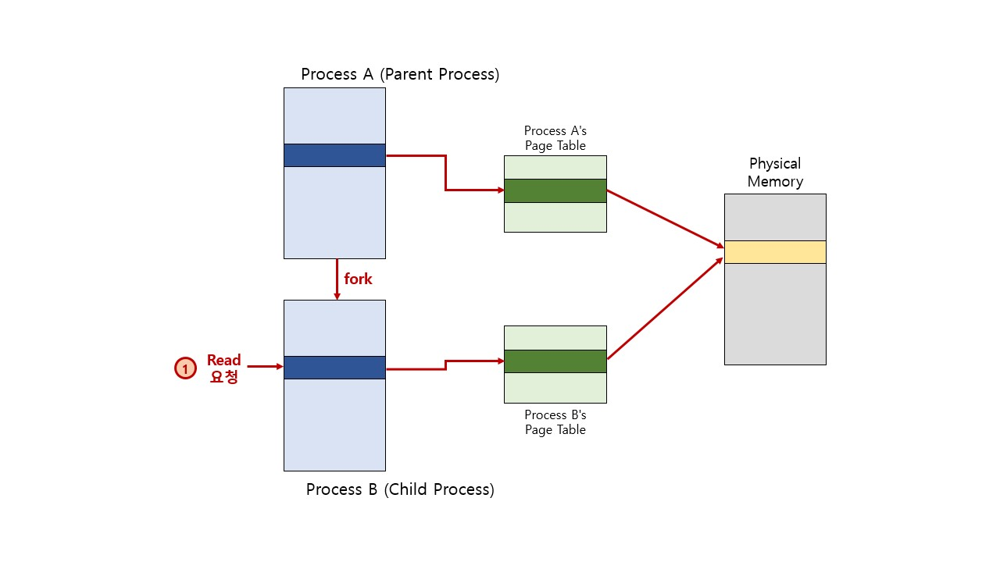
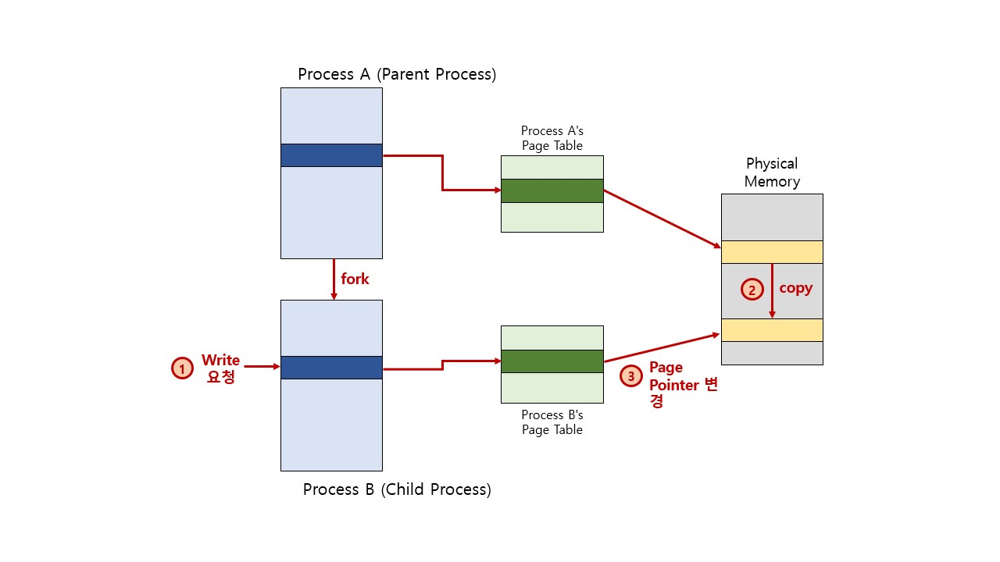

# Paging System

페이징이란, 크기가 동일한 페이지로 가상 주소 공간과 이에 매칭하는 물리 주소 공간을 관리하는 것

리눅스에서는 4KB로 paging하며, 페이지 번호를 기반으로 가상 주소와 물리 주소의 매핑 정보를 기록하고 사용함

> 프로세스(4GB)의 PCB에 Page Table 구조체를 가리키는 주소가 들어있음
>
> Page Table에는 가상 주소와 물리 주소간 매핑 정보가 있음

## Paging System Structure

- page(or page frame): 고정된 크기의 block(4KB)

- paging system

  - 가상주소 v = (p, d)
  - p: 가상 메모리 페이지
  - d(변위): p안에서 참조하는 위치

- page table

  - 물리 주소에 있는 페이지 번호와 해당 페이지의 첫 물리 주소 정보를 매핑한 표
  - 가상주소 v = (p, d) 라면
    - p: 페이지 번호
    - d: 페이지 처음부터 얼마나 떨어진 위치인지

  

- paging system 동작

  - 해당 프로세스에서 특정 가상 주소에 엑세스하려면
    - 해당 프로세스의 page table에 해당 가상 주소가 포함된 page 번호가 있는지 확인
    - page 번호가 있으면 이 page가 매핑된 첫 물리 주소를 알아내고(p')
    - p' + d 가 실제 물리 주소가 됨

## Paging System and MMU(Computer Structure)

- CPU는 가상 주소 접근시
  - MMU 하드웨어 장치를 통해 물리 메모리 접근
- 프로세스 생성 시, 페이지 테이블 정보 생성
  - PCB 등에서 해당 페이지 테이블 접근이 가능하고, 관련 정보는 물리 메모리에 적재
  - 프로세스 구동 시, 해당 페이지 테이블 base 주소가 별도 레지스터에 저장(CR3)
  - CPU가 가상 주소 접근 시, MMU가 페이지 테이블 base 주소를 접근해서, 물리 주소를 가져옴

## Paging System and Shared Memory

### Paging System Pros

- 프로세스간 동일한 물리 주소를 가리킬 수 있음(공간 절약, 메모리 할당 시간 절약)

  

-  물리 주소 데이터 변경시

  - 물리 주소에 데이터 수정 시도 시, 물리 주소를 복사할 수 있음(copy-on-write)

  

