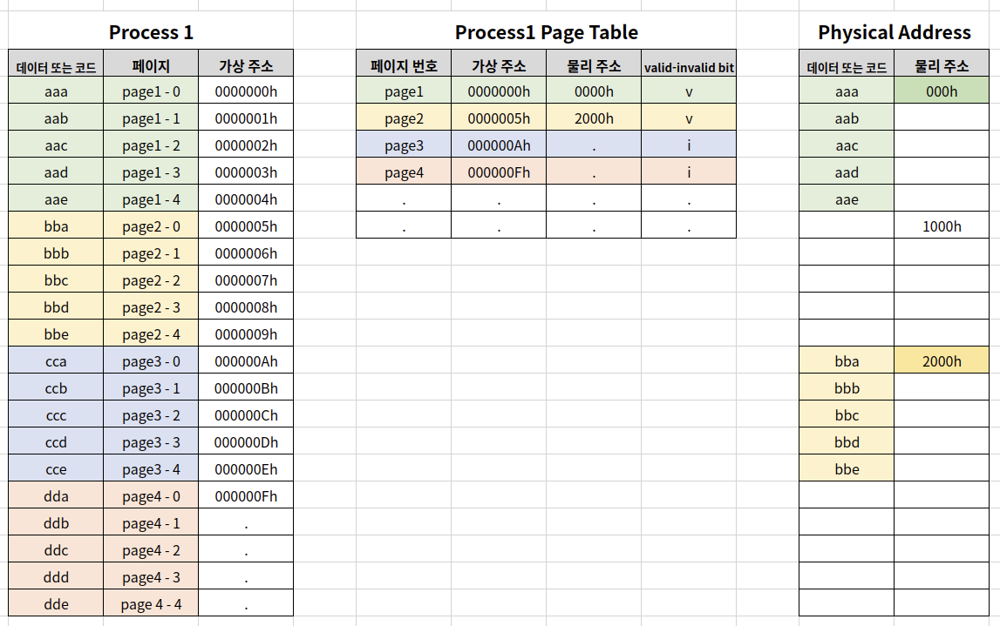
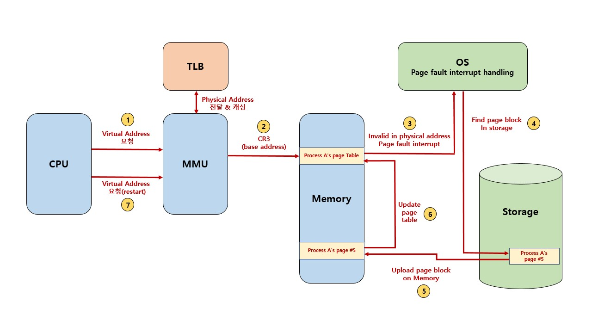

# Page Fault

## Demand Paging(=Demanded Paging)

프로세스 모든 데이터를 메모리로 적재하지 않고, 실행 중 필요한 시점에서만 메모리로 적재함

선행 페이징(anticipatory paging or prepaging)의 반대 개념

(선행 페이징은 미리 프로세스 관련 모든 데이터를 메모리에 올려놓고 실행)

더이상 필요하지 않은 페이지 프레임은 다시 저장매체에 저장 -> **페이지 교체 알고리즘 필요**

## Page Fault

어떤 페이지가 실제 물리 메모리에 없을 때 일어나는 인터럽트

운영체제는 page fault가 일어나면, 해당 페이지를 물리 메모리에 올림

### Page Fault and Interrupt

