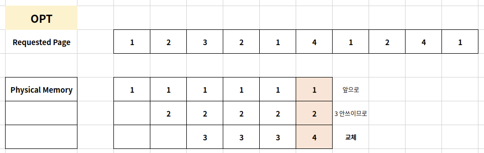
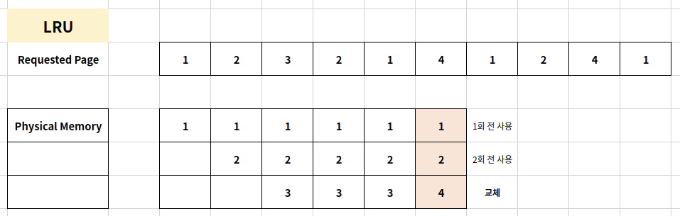
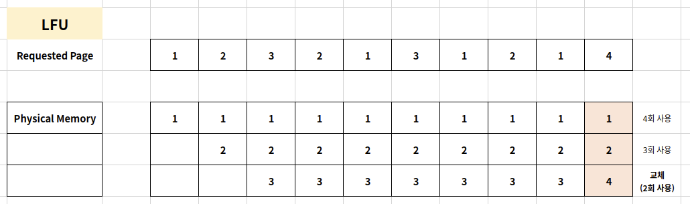
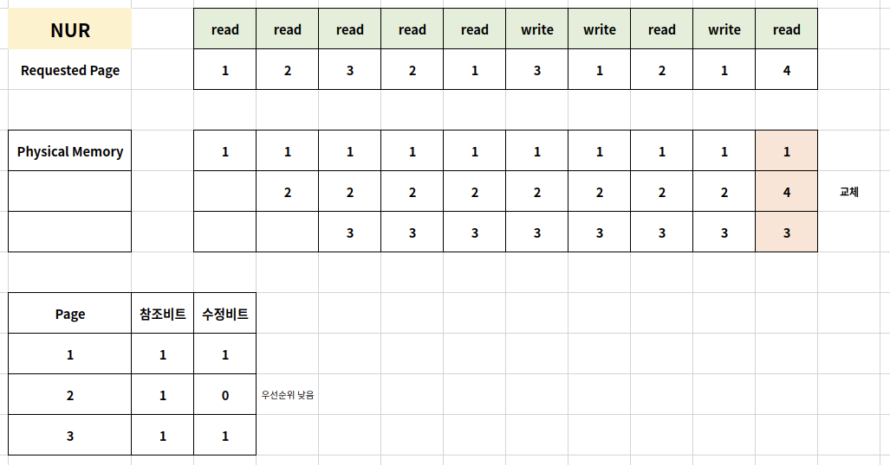

# Page Replacement

## Page Replacement Policy

운영체제가 특정 페이지를 물리 메모리에 올리려고 하는데, 물리 메모리가 다 차있다면,

기존 페이지 중 하나를 물리 메몰에서 저장 매체로 내리고(=저장하고) 새로운 페이지를 해당 물리 메모리 공간에 올림

이 때, 어떤 페이지를 물리 메모리에서 저장 매체로 내릴 것인가에 대한 것이 페이지 교체 정책임

## Page Replacement Algorithm

### 1. FIFO

가장 먼저 들어온 페이지를 내림

### 2. OPT(OPTimal)

최적 페이지 교체 알고리즘은 앞으로 가장 오랫동안 사용하지 않을 페이지를 내림

일반적인 OS에서 구현 불가

### 3. LRU(Least Recently Used)

가장 오래 전에 사용된 페이지를 내림

OPT 교체 알고리즘이 구현이 불가하므로, 과거 기록을 기반으로 시도

### 4. LFU(Least Frequently Used)

가장 적게 사용된 페이지를 내림

### 5. NUR(Not Used Recently)

LRU와 마찬가지로 최근에 사용하지 않은 페이지부터 교체하는 기법

각 페이지마다 참조 비트(R), 수정 비트(M)를 두고,

(R, M) = (0, 0), (0, 1), (1, 0), (1, 1) 순으로 페이지 교체

## Thrashing

스레싱은 반복적으로 페이지 폴트가 발생해서

과도하게 페이지 교체 작업이 일어나 실제로는 아무일도 하지 못하는 상황을 이야기함

