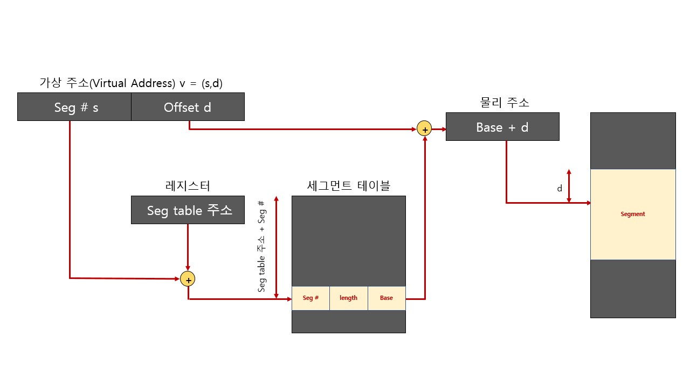
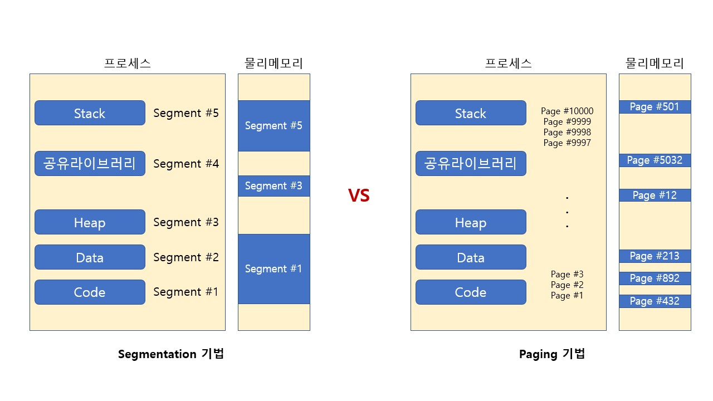

#  Segmentation

가상 메모리를 서로 크기가 다른 논리적인 단위인 세그먼트(Segment)로 분할

세그먼트 가상 주소

- v = (s, d)
- s는 세그먼트 번호
- d는 블록 내 세그먼트의 변위

## Segmentation VS Paging

### 1. 공통점

세그멘테이션과 페이징 시스템 모두 하드웨어의 지원이 필요함

### 2. 차이점

페이징 기법이 가상 메모리를 같은 크기의 블록으로 분할하는 것에 반해 세그먼트는 서로 다른 크기의 블록으로 분할한다는 것에서 차이가 있음

### 3. 각 기법의 문제점

- 내부 단편화(페이지 기법): 페이지 블록만큼 데이터가 딱 맞게 채워져있지 않을 때 공간 낭비
- 외부 단편화(세그멘테이션 기법): 물리 메모리가 원하는 연속된 크기의 메모리를 제공해주지 못하는 경우