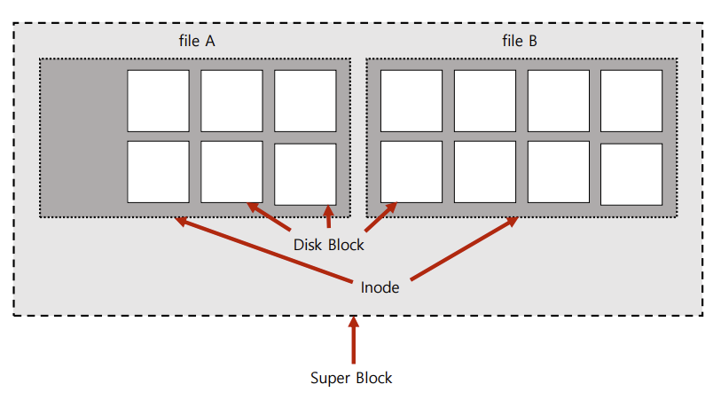
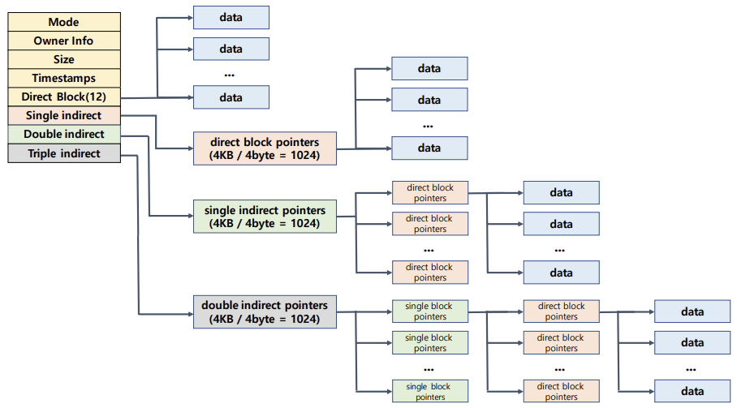
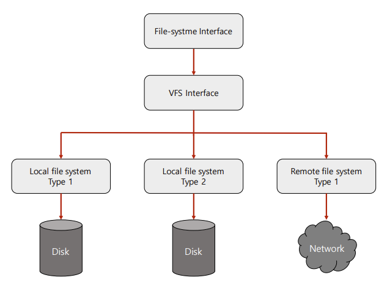

# inode File System

- 수퍼 블록: 파일 시스템 정보 및 파티션 정보 포함
- 아이노드 블록: 파일 상세 정보
- 데이터 블록: 실제 데이터

## inode and File

파일: inode 고유값과 자료구조에 의해 주요 정보 관리

- '파일이름:inode'로 파일이름은 inode 번호와 매칭
- 파일 시스템에서는 inode를 기반으로 파일 엑세스
- inode기반 메타 데이터 저장
  - inode기반 메타 데이터: 파일 권한, 소유자 정보, 파일 사이즈, 생성시간  등

### Dentry

- 각 디렉토리 엔트리(dentry)를 탐색
- 각 엔트리는 해당 디렉토리 파일, 디렉토리 정보를 가지고 있음
- 디렉토리 파일이름에 해당하는 inode 정보를 가져옴

## Virtual File System

Network 등 다양한 기기도 동일한 파일 시스템 인터페이스를 통해 관리 가능

유닉스 운영체제에서 모든 것은 파일이라는 철학을 따름

- 모든 인터렉션은 파일을 읽고 쓰는 것처럼 이루어져 있음
- 마우스, 키보드와 같은 모든 디바이스 관련된 기술도 파일과 같이 다루어짐
- 모든 자원에 대한 추상화 인터페이스로 파일 인터페이스를 활용