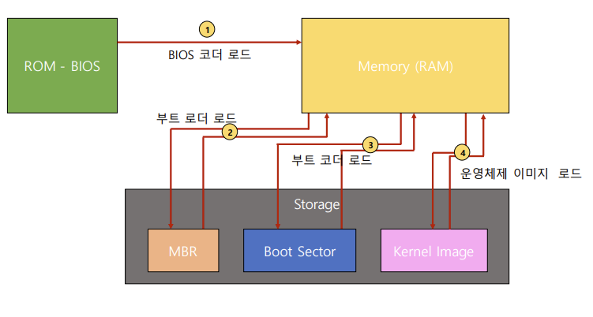

# Boot

boot란 컴퓨터를 켜서 동작시키는 절차

**Boot 프로그램**

: 운영체제 커널을 storage에서 특정 주소의 물리 메모리로 복사하고 커널의 처음 실행위치로 PC를 가져다 놓는 프로그램

## Booting process

컴퓨터를 켜면

1. BIOS가 특정 Storage를 읽어와 bootstra loader를 메모리에 올리고 실행함
2. bootstrap loader 프로그램이 있는 곳을 찾아서 실행시킴

