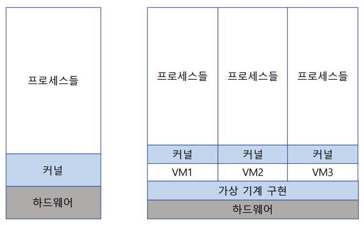
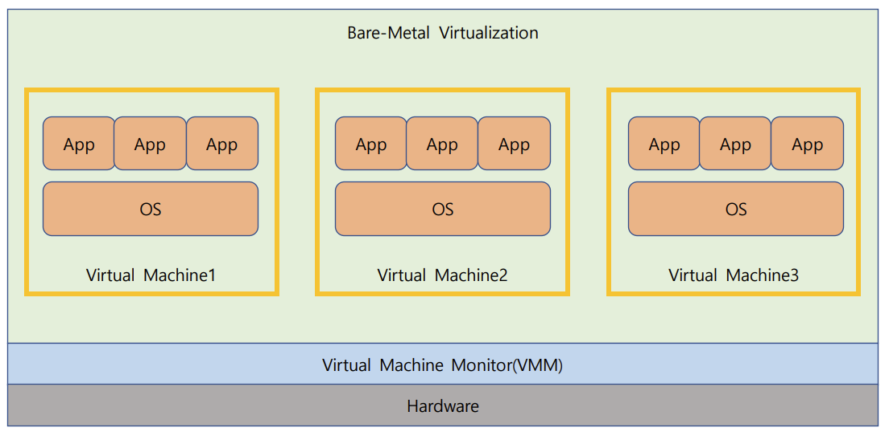
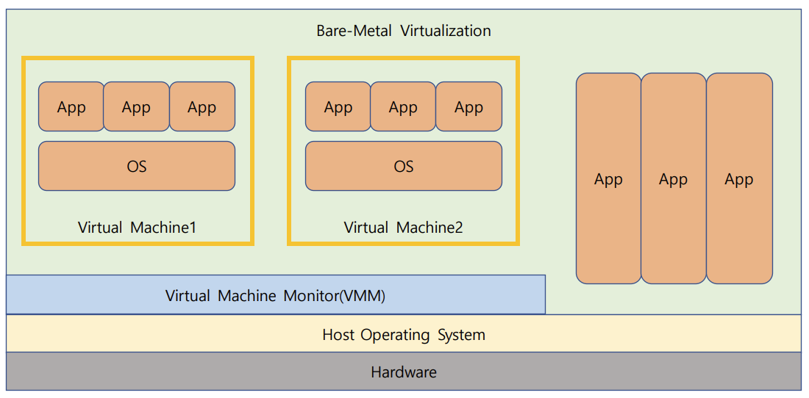
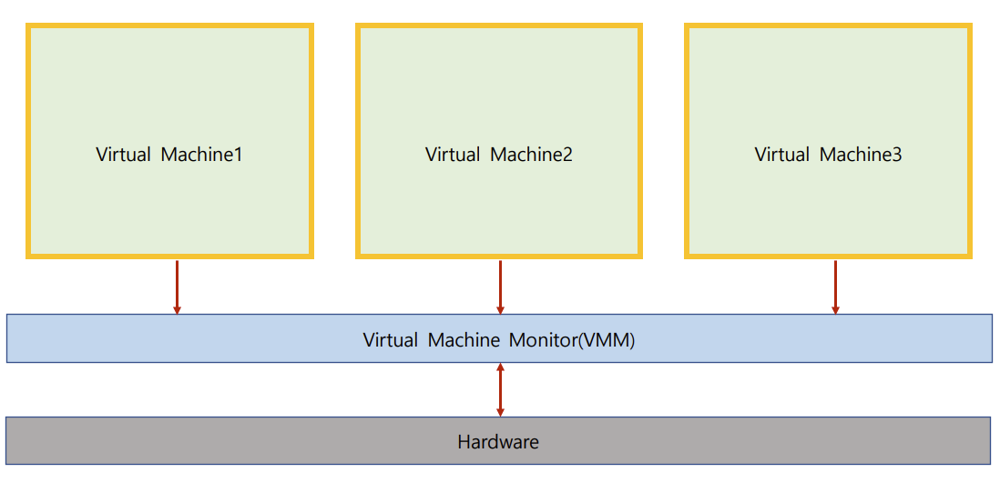
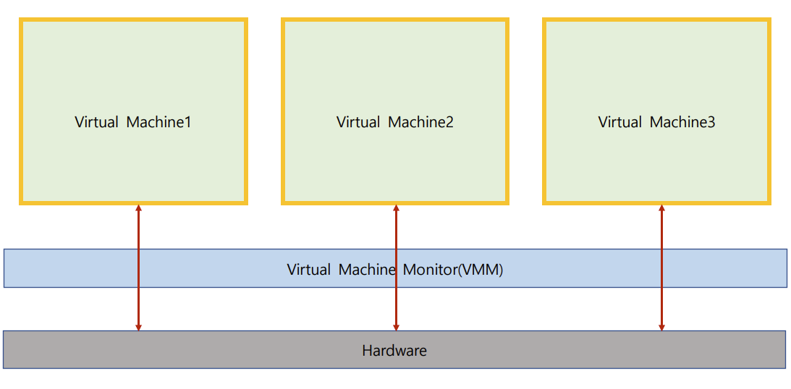
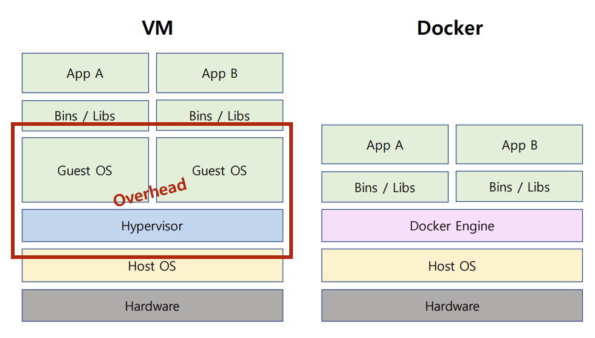

# Virtual Machine

하나의 하드웨어(CPU, Memory 등)에 다수의 운영체제를 설치하고, 개별 컴퓨터처럼 동작하도록 하는 프로그램




## Vitual Machine Type1, 2

### Virtual Machine Type1(= Native or Bare Metal)

하이퍼바이저(또는 버추얼 머신 모니터): 운영체제와 응용프로그램을 물리적 하드웨어에서 분리하는 프로세스

하이퍼바이저 또는 버추얼 머신 모니터(VMM)라고 하는 소프트웨어가 하드웨어에서 직접 구동

 ex)  Xen, KVM(AWS 등에서 사용)




### Virtual Machine Type2

하이퍼바이저 또는 버추얼 머신 모니터(VMM)라고 하는 소프트웨어가 Host OS 상위에 설치

ex) VMWare, Prallels Desktop(MAC)




## Full / Half Virtualization

### Full Virtualization

전가상화: 각 가상머신이 하이퍼바이저를 통해서 하드웨어와 통신

하이퍼바이저가 마치 하드웨어인 것처럼 동작하므로, 가상머신의 OS는 자신이 가상 머신인 상태인지를 모름

최근에는 하드웨어 성능개선으로 전가상화 기술을 선호




### Half Virtualization

반가상화: 각 가상머신에서 직접 하드웨어와 통신

각 가상머신에 설치되는 OS는 가상머신인 경우, 이를 인지하고 각 명령에 하이퍼바이저 명령을 추가해서 하드웨어와 통신

이 때 하이퍼바이저는 리소스를 관리




## Docker

도커: 운영체제 레벨에서 별도로 분리된 실행환경을 제공

마치 리눅스를 처음 설치했을 때와 유사한 실행환경을 만들어주는 리눅스 컨테이너 기술 기반

리눅스 컨테이너 기술이므로 macOS나 windows에 설치할 경우는 가상머신 기반 제공

경량 이미지로 실행환경을 통째로 백업, 실행 가능(실무에 많이 사용됨)

```
docker pull ubuntu:latest
docker images
docker run -i -t --name hello ubuntu /bin/bash
docker start hello
docker restart hello
docker attach hello
```


### Virtual Machine VS Docker

#### Virtual machine

- 컴퓨터 하드웨어 가상화(하드웨어 전체 가상화)
- 성능저하 이슈 존재(하이퍼바이저 사용, 추가 OS 필요)


#### Docker

- 커널 추상화




## Java Virtual Machine

가상 머신과는 다른 목적(응용프로그램 레벨 가상화)

java 컴파일러는 CPU dependency를 가지지 않는 bytecode를 생성함

이 파일을 java virtual machine에서 실행함

각 운영체제를 위한 java virtual machine 프로그램 존재