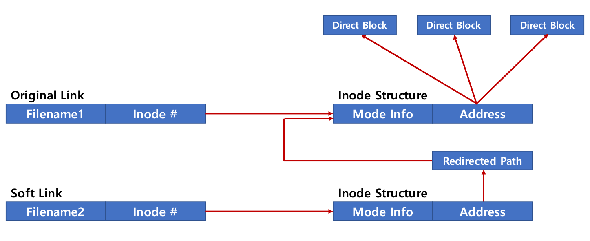

# Hard Link and Soft Link

윈도우 OS에서 바로가기를 만들듯이 리눅스에는 링크가 있음.

링크는 hard link와 soft link로 나눌 수 있음.


## Hard Link


cp 명령을 통해 A파일을 B파일로 복사하면 A와 B는 별도의 저장공간에 각각 물리적으로 저장됨

그러나 A파일과 B파일에 하드링크를 하면 동일 inode를 가리키는 파일 이름만 만들며 A와 B는 동일한 파일을 가리킴

따라서 inode도 동일하고, 전체 파일 용량이 달라지지 않음

원본이 삭제되더라도 `A:inode정보`만 삭제되고, inode를 가진 실제 파일은 그대로 남음

원본파일을 수정하면 동일한 내용에 접근 가능

```bash
$ ln link.txt hardlink.txt
$ ls -al
>>>
-rw-rw-r-- 2 user user    6  3월 19 16:36 hardlink.txt
-rw-rw-r-- 2 user user    6  3월 19 16:36 link.txt
$ ls -i
>>>       15 hardlink.txt        15 link.txt
```


## Soft Link



심볼릭 링크라고도 하며 윈도우 OS의 바로가기와 동일함

별도의 inode 구조체를 가지며 주소를 지칭하는 곳에 원본파일의 가상주소를 가지고 있어

원본이 삭제될 경우 파일에 접근할 수 없음

원본파일을 수정하면 동일한 내용에 접근 가능

```bash
$ ln -s link.txt softlink.txt
$ ls -al
>>>
-rw-rw-r-- 2 user user    6  3월 19 16:36 link.txt
lrwxrwxrwx 1 user user    8  3월 19 16:37 softlink.txt -> link.txt
$ ls -i
>>>       15 link.txt  23068674 softlink.txt
```


## 특수파일

### Device

1. Block Device(블록 디바이스)
   - HDD, CD/DVD와 같이 블록 또는 섹터 등 정해진 단위로 데이터 전송
   - IO 송수신 속도가 높음
2. Character Device(캐릭터 디바이스)
   - 키보드, 마우스 등 byte 단위 데이터 전송
   - IO 송수신 속도가 낮음