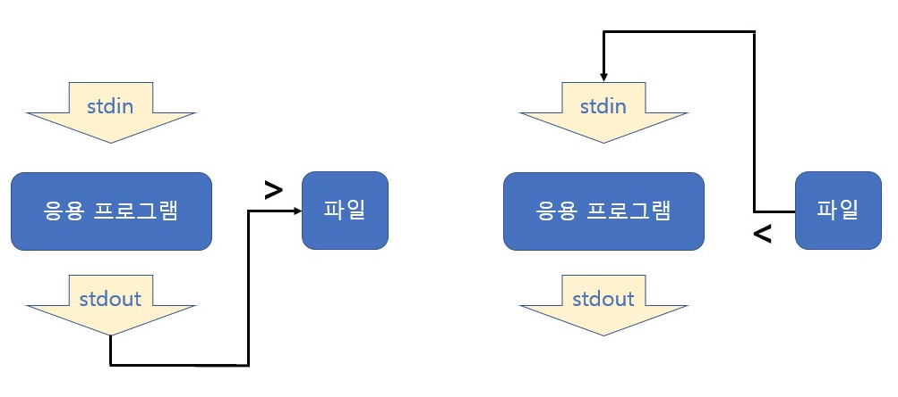
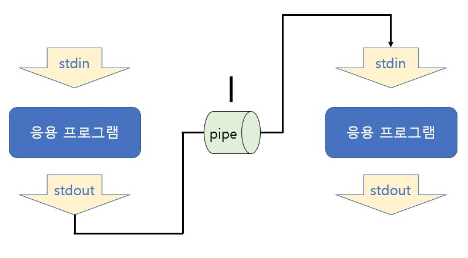

# Redirection and Pipe

## Standard Stream

command로 실행되는 프로세스는 세 가지 스트림을 가지고 있음

- Standard Input Stream(표준 입력 스트림) - stdin
- Standard Output Stream(표준 출력 스트림) - stdout
- Standard Error Stream(오류 출력 스트림) - stderr

모든 스트림은 일반적인 plain text로 console에 출력하도록 되어있음


## Redirection

리다이렉션은 표준 스트림 흐름을 바꿔줄 수 있는 것

리다이렉션은 >, <를 사용하며 기존 파일에 추가는 >> 또는 <<를 사용함

주로 명령어 표준 출력을 화면이 아닌 파일에 쓸 때 사용함




### Example

1. ls > files.txt
   - ls로 출력되는 표준 출력 스트림의 방향을 files.txt로 바꿔주어 files.txt에 ls로 출력되는 결과가 저장됨

2. head < files.txt
   - files.txt의 파일 내용이 head라는 파일의 처음부터 10번째 라인까지 출력해주는 명령으로 넣어짐, 즉 files.txt의 앞 10라인이 출력됨
3. head < files.txt > files2.txt
   - files.txt의 파일 내용이 head로 들어가서 files.txt의 앞 10번짜 라인을 출력하는데 head의 출력 스트림이 다시 files2.txt로 들어감
   - 즉, head는 files.txt 내용을 출력하지 않고 해당 내용이 files2.txt에 저장됨
4. ls >> files.txt
   - 기존에 있는 files.txt 파일 끝에 ls 출력 결과를 추가함


## Pipe

두 프로세스 사이에서 한 프로세스의 출력 스트림을 또다른 프로세스의 입력 스트림으로 사용하도록 해주는 것




### grep

grep은 검색 명령어로 다음과 같이 사용함

```bash
$ grep [-OPTION] [PATTERN] [FILE OR DIRECTORY NAME]
```

> <option>
>
> -i: 영문의 대소문자를 구별하지 않음
>
> -v: pattern을 포함하지 않는 라인을 출력함
>
> -n: 검색 결과의 각 행의 선두에 행 번호를 넣음
>
> -l: 파일명만 출력
>
> -c: 패턴과 일치하는 라인의 개수만 출력
>
> -r: 하위 디렉토리까지 검색


### Example

1. ls | grep files.txt
   - ls 명령을 통한 출력 내용이 grep 명령의 입력 스트림으로 들어감
   - grep files.txt는 grep 명령의 입력스트림을 검색해서 files.txt가 들어있는 입력 내용만 출력해줌
   - 즉, ls명령으로 해당 디렉토리/파일 중에 files.txt 파일이 있는지를 출력