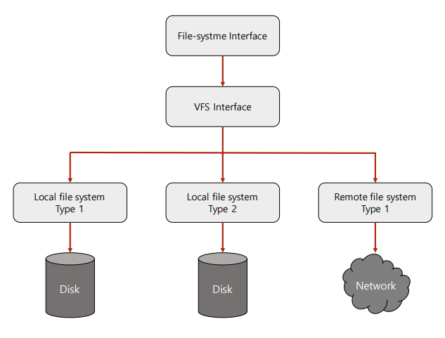

# Linux File System

 리눅스는 모든 것은 파일이라는 철학을 따름

따라서 모든 자원에 대한 추상화 인터페이스로 파일 인터페이스를 활용

또한 파일 네임스페이스로 전역 네임스페이스를 사용

> 추상화(abstraction): 복잡한 기능/자료/데이터에서 핵심적 개념/기능을 간추려 내는 것

## Super Block, Inode and File

- 슈퍼블록: 파일 시스템의 정보
- 파일: inode 고유값과 자료구조에 의해 주요 정보 관리
  - `파일이름:inode`로 파일이름은 inode 번호와 매칭
  - 파일 시스템에서는 inode를 기반으로 파일 엑세스
  - inode 기반 메타 데이터 저장(파일 권한, 소유자 정보, 파일 사이즈, 생성시간 등 시간관련 정보, 데이터 저장 위치 등)

> ext file system inode structure