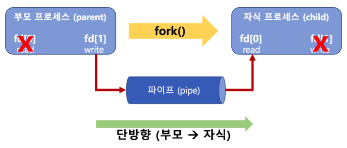

# IPC System Call

프로세스간 커뮤니케이션인 IPC(InterProcess Communication)기법은

file 사용, message queue, shared memory, pipe, signal, semaphore, socket 등이 있음


## Pipe

기본 파이프는 단방향 통신이며

fork()로 자식 프로세스를 만들었을 때 부모와 자식간의 통신이다.



### Example

```c
char* msg = "Hello Child Process!";
int main()
{
    char buf[255];
    int fd[2], pid, nbytes;
    if (pipe(fd) < 0)
		exit(1);
	pid = fork(); 
	if (pid > 0) {
		write(fd[1], msg, MSGSIZE);
		exit(0);
	}
	else {
		nbytes = read(fd[0], buf, MSGSIZE);
		printf("%d %s\n", nbytes, buf);
		exit(0);
	}
	return 0;
}
```


## Message Queue

queue와 마찬가지로 FIFO 정책으로 데이터 전송

### Example

```c
msqid = msgget(key, msgflg)
```

- msgflg 설정
  - IPC_CREAT: 새로운 키면 식별자를 새로 생성하며 `IPC_CREAT|접근권한` 과 같이 작성함

```c
msgsnd(msqid, &sbuf, buf_length, IPC_NOWAIT)
```

- msgflg 설정
  - 0: 블록모드
  - IPC_NOWAIT: 비블록모드

```c
ssize_t msgrcv(int msqid, void *msgp, size_t msgsz, long msgtyp, int msgflg)
msgrcv(msqid, &rbuf, MSGSZ, 1, 0)
```

- msgtyp 설정
  - 0: 첫번째 메세지
  - 양수: 타입이 일치하는 첫번째 메세지
- msgflg 설정
  - 0: 블록모드
  - IPC_NOWAIT: 비블록모드