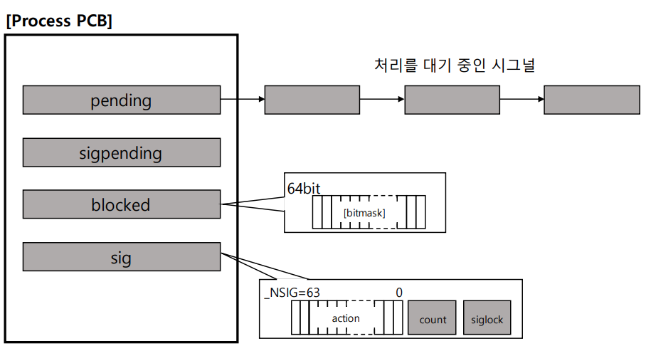

# Signal

시그널은 유닉스에서 30년 이상 사용된 전통적인 기법으로

커널 또는 프로세스에서 다른 프로세스에 어떤 이벤트가 발생되었는지를 알려주는 기법

시그널의 종류와 각 시그널에 따른 기본 동작은 미리 정해져있음

- SIGKILL: 프로세스를 죽여라(슈퍼관리자가 사용하는 시그널)
- SIGALARM: 알람을 발생한다
- SIGSTP: 프로세스를 멈춰라(Ctrl + z)
- SIGCONT: 멈춰진 프로세스를 실행해라
- SIGINT: 프로세스에 인터럽트를 보내서 프로세스를 죽여라(Ctrl + c)
- SIGSEGV: 프로세스가 다른 메모리영역을 침범했다

```bash
$ kill -l
 1) SIGHUP	     2) SIGINT  	 3) SIGQUIT	     4) SIGILL  	 5) SIGTRAP
 6) SIGABRT	     7) SIGBUS  	 8) SIGFPE  	 9) SIGKILL 	10) SIGUSR1
11) SIGSEGV	    12) SIGUSR2 	13) SIGPIPE 	14) SIGALRM 	15) SIGTERM
16) SIGSTKFLT	17) SIGCHLD 	18) SIGCONT 	19) SIGSTOP 	20) SIGTSTP
21) SIGTTIN	    22) SIGTTOU  	23) SIGURG  	24) SIGXCPU 	25) SIGXFSZ
26) SIGVTALRM	27) SIGPROF	    28) SIGWINCH	29) SIGIO   	30) SIGPWR
31) SIGSYS   	34) SIGRTMIN	35) SIGRTMIN+1	36) SIGRTMIN+2	37) SIGRTMIN+3
38) SIGRTMIN+4	39) SIGRTMIN+5	40) SIGRTMIN+6	41) SIGRTMIN+7	42) SIGRTMIN+8
43) SIGRTMIN+9	44) SIGRTMIN+10	45) SIGRTMIN+11	46) SIGRTMIN+12	47) SIGRTMIN+13
48) SIGRTMIN+14	49) SIGRTMIN+15	50) SIGRTMAX-14	51) SIGRTMAX-13	52) SIGRTMAX-12
53) SIGRTMAX-11	54) SIGRTMAX-10	55) SIGRTMAX-9	56) SIGRTMAX-8	57) SIGRTMAX-7
58) SIGRTMAX-6	59) SIGRTMAX-5	60) SIGRTMAX-4	61) SIGRTMAX-3	62) SIGRTMAX-2
63) SIGRTMAX-1	64) SIGRTMAX	
```


## Signal Action

프로그램에서 특정 시그널의 기본 동작 대신 다른 동작을 하도록 구현 가능

각 프로세스에서 시그널 처리에 대해 다음과 같은 동작 설정이 가능함

- 시그널 무시
- 시그널 블록(블록을 푸는 순간, 해당 프로세스에서 시그널 처리)
- 프로그램 안에 등록된 시그널 핸들러로 재정의한 특정 동작 수행
- 등록된 시그널 핸들러가 없다면 커널에서 기본동작 수행


### Example

```c
#include <sys/types.h>
#include <signal.h>

int kill(pid_t pid, int sig);

void (*signal (int signum, void (*handler) (int))) (int);

# SIG_IGN-시그널 무시, SIG_DFL-디폴트 동작
signal(SININT, SIG_IGN);

# SIGINT 시그널 수신 시 signal_handler 함수 호출
signal(SIGINT, (void *)signal_handler)
```


## Signal and Process

PCB에 해당 프로세스가 블록 또는 처리해야하는 시그널 관련 정보 관리

커널 모드에서 사용자 모드 전환시 시그널 정보 확인하여 해당 처리

