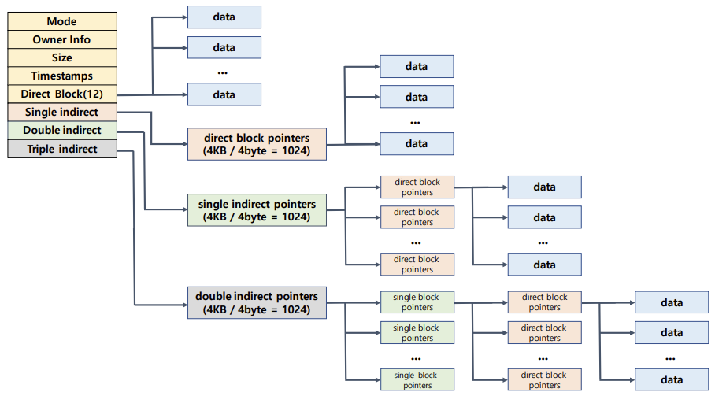

# File System and System Call

## Inode File System



## System Call

### Example

#### stat

inode 정보를 한 번에 가져오는 system call

```c
#include <sys/types.h>
#include <sys/stat.h>
#include <unistd.h>

int stat(const char *path, struct stat *buf);
int fstat(int filedes, struct stat *buf);
```

##### stat structure

```c
struct stat {
    dev_t		st_dev;		/* ID of device containing file */
    ino_t		st_ino;		/* inode number */
    mode_t   	st_mode;   	/* 파일 종류 및 접근 권한 */
    nlink_t  	st_nlink;	/* hardlink 된 횟수 */
    uid_t		st_uid;  	/* 파일 owner */
    gid_t		st_gid;   	/* group ID of owner */
    dev_t		st_rdev;  	/* device ID (if special file) */
    off_t		st_size;	/* 파일 크기(bytes) */
    blksize_t	st_blksize;	/* blocksize for file system I/O */
    blkcnt_t 	st_blocks;	/* number of 512B blocks allocated */
    time_t   	st_atime;	/* time of last access */
    time_t   	st_mtime;	/* time of last modification */
    time_t   	st_ctime;	/* time of last status change */
};
```


#### Standard Stream

command로 실행되는 프로세스는 세 가지 스트림을 가지고 있음

- 표준 입력 스트림(Standard Input Stream) - `stdin`
- 표준 출력 스트림(Standard Output Stream) - `stdout`
- 오류 출력 스트림(Standard Error Stream) - `stderr`

모든 스트림은 일반적인 plain text로 console에 출력하도록 되어있음

